# 🚀 QualityDoc-Polyglot
---

## 📑 Índice

1. [Visión General](#-visión-general)
2. [Guía de Instalación y Despliegue](#-guía-de-instalación-y-despliegue)
   - [Paso 1: Clonar el Repositorio](#-paso-1-clonar-el-repositorio)
   - [Paso 2: Crear el Archivo de Entorno Global](#-paso-2-crear-el-archivo-de-entorno-global)
   - [Paso 3: Configurar las Variables de Entorno](#️-paso-3-configurar-las-variables-de-entorno)
   - [Paso 4: Ejecutar el Despliegue Automático](#-paso-4-ejecutar-el-despliegue-automático)
3. [Arquitectura Desplegada](#-arquitectura-desplegada)
4. [Accesos al Sistema](#-accesos-al-sistema)
5. [Verificación del Estado de los Contenedores](#-verificación-del-estado-de-los-contenedores)
6. [Detener el Sistema](#-detener-el-sistema)
7. [Actualizar el Proyecto](#-actualizar-el-proyecto)
8. [Tecnologías Utilizadas](#-tecnologías-utilizadas)
9. [Equipo de Desarrollo](#-equipo-de-desarrollo)
10. [Arquitectura del Sistema](#-arquitectura-del-sistema)
11. [Gateway Centralizado](#-gateway-centralizado)
12. [Portal Administrativo (.NET)](#-portal-administrativo-net)
13. [Portal Operador (Laravel)](#-portal-operador-laravel)
14. [Motor de Búsqueda (FastAPI)](#-motor-de-búsqueda-fastapi)
15. [Estrategia de Persistencia Políglota](#-estrategia-de-persistencia-políglota)
16. [Seguridad](#-seguridad)
17. [Infraestructura Docker](#-infraestructura-docker)
18. [Beneficios de la Arquitectura](#-beneficios-de-la-arquitectura)
19. [Historias de Usuario](#-historias-de-usuario)
    - [Super Admin](#-super-admin)
    - [Administrador de Empresa](#-administrador-de-empresa)
    - [Creador de Documentos](#-creador-de-documentos)
    - [Revisor y Aprobador](#-revisor-y-aprobador)
    - [Operario](#-operario)
    - [Auditor](#-auditor)
    - [Historias Transversales](#-historias-de-usuario-transversales)
20. [Especificación de Requerimientos](#-especificación-de-requerimientos)
    - [Requerimientos Funcionales (RF-01 a RF-10)](#-requerimientos-funcionales)
    - [Requerimientos No Funcionales (RNF-01 a RNF-07)](#-requerimientos-no-funcionales)
21. [Modelado de Datos y Diagramas](#-modelado-de-datos-y-diagramas)
    - [Diagrama Entidad-Relación (SQL Server)](#-diagrama-entidad-relacion-sql-server)
    - [Modelo Relacional (PostgreSQL)](#-modelo-relacional-postgresql)
    - [Esquema de Colecciones (MongoDB)](#-esquema-de-colecciones-mongodb)
    - [Diccionario de Datos](#-diccionario-de-datos)
    - [Diagrama de Casos de Uso](#-diagrama-de-casos-de-uso)
    - [Diagrama de Clases (.NET)](#-diagrama-de-clases-net)
    - [Diagrama de Secuencia (Flujo de Aprobación)](#-diagrama-de-secuencia-flujo-de-carga-y-aprobación-de-un-documento)
    - [Diagrama de Despliegue (Contenedores)](#-diagrama-de-despliegue-arquitectura-de-contenedores)
22. [Documentación Adicional](#-documentación-adicional)

---

## Visión General
QualityDoc-Polyglot es una plataforma de gestión documental y cumplimiento normativo basada en una arquitectura de microservicios políglota (Polyglot Microservices Architecture).

La solución utiliza múltiples tecnologías especializadas para aprovechar las fortalezas de cada ecosistema:

* **ASP.NET Core 10.0 MVC** para procesos administrativos y flujos de aprobación complejos.
* **PHP Laravel 10** para la interacción rápida de operadores y usuarios finales.
* **Python FastAPI** para indexación, búsqueda avanzada y recuperación eficiente de documentos.
* **Nginx** como Gateway y Reverse Proxy centralizado.
* **SQL Server**, **PostgreSQL** y **MongoDB** como estrategia de persistencia políglota.

---

# 📋 Guía de Instalación y Despliegue

Sigue los pasos descritos a continuación para clonar, configurar y desplegar toda la infraestructura de **QualityDoc-Polyglot** de forma automatizada.

## 📥 Paso 1: Clonar el Repositorio

Abre una terminal en tu servidor Debian, Ubuntu o equipo local y ejecuta:

```bash
git clone https://github.com/Gabriel89zz/QualityDoc-Polyglot.git
cd QualityDoc-Polyglot
```

---

## 📄 Paso 2: Crear el Archivo de Entorno Global

Genera el archivo `.env` a partir de la plantilla incluida en el proyecto:

```bash
cp .env.example .env
```

---

## ⚙️ Paso 3: Configurar las Variables de Entorno

Edita el archivo `.env` con tu editor favorito:

```bash
nano .env
```

Es importante configurar correctamente:

* La IP del servidor donde se ejecutará el sistema.
* El puerto de acceso principal.
* Las credenciales de las bases de datos.
* Los datos del servicio de correo electrónico.

### Ejemplo de configuración

```env
# ==========================================
# CONFIGURACIÓN GENERAL
# ==========================================

PROYECTO_NOMBRE=QualityDoc-Polyglot

# IP física o pública del servidor
IP_DEL_SERVIDOR=192.168.1.184

# Puerto externo utilizado por Nginx
APP_PORT=8080

# ==========================================
# SQL SERVER
# ==========================================

SQL_SERVER_USER=sa
SQL_SERVER_PASSWORD=TuPasswordSeguro123!

# ==========================================
# POSTGRESQL (AUDITORÍA)
# ==========================================

POSTGRES_DB=quality_audit
POSTGRES_USER=admin
POSTGRES_PASSWORD=tu_password_postgres_seguro

# ==========================================
# MONGODB (BÚSQUEDA)
# ==========================================

MONGO_INITDB_ROOT_USERNAME=mongo_admin
MONGO_INITDB_ROOT_PASSWORD=tu_password_mongo_seguro

# ==========================================
# SERVICIO DE CORREO (.NET)
# ==========================================

SMTP_EMAIL=tu_correo_emisor@gmail.com
SMTP_PASSWORD=tu_token_de_aplicacion_smtp
```

> ⚠️ **Importante:** Verifica que el puerto configurado no esté siendo utilizado por otro servicio en el servidor.

---

## ⚡ Paso 4: Ejecutar el Despliegue Automático

El proyecto cuenta con orquestadores inteligentes que detectan tu sistema operativo, verifican dependencias (instalando Docker si falta en Linux), crean redes virtuales y levantan los módulos en cascada.

Si estás en Linux/Servidor Ubuntu (Bash):

```bash
bash deploy.sh
```

Si estás en Windows (CMD):
Solo dale doble clic al archivo deploy.bat desde el explorador de archivos, o ejecútalo en la terminal:
```bash
deploy.bat
```

Este script realizará automáticamente:

* ✅ Configuración de permisos necesarios.
* ✅ Generación de llaves y recursos de seguridad.
* ✅ Creación de redes Docker.
* ✅ Construcción de imágenes.
* ✅ Despliegue de los microservicios.
* ✅ Inicio de los contenedores en segundo plano.

---

# 🏗️ Arquitectura Desplegada

El proceso de despliegue levantará los siguientes componentes:

| Servicio                   | Tecnología   |
| -------------------------- | ------------ |
| Gateway Web                | Nginx        |
| Backend Principal          | ASP.NET Core |
| Base de Datos Principal    | SQL Server   |
| Servicio de Auditoría      | PostgreSQL   |
| Motor de Búsqueda          | MongoDB      |
| API de Búsqueda            | FastAPI      |
| Servicio de Notificaciones | .NET SMTP    |

---

# 🌐 Accesos al Sistema

Una vez finalizado el despliegue, podrás acceder a los distintos servicios mediante la IP y puerto configurados.

## Portal Principal de Calidad y Administración

```text
http://<IP_DEL_SERVIDOR>:<APP_PORT>/admin/
```

### Ejemplo

```text
http://192.168.1.184:8080/admin/
```

---

## Documentación Interactiva de la API de Búsqueda

```text
http://<IP_DEL_SERVIDOR>:8000/docs
```

### Ejemplo

```text
http://192.168.1.184:8000/docs
```

---

# 🔍 Verificación del Estado de los Contenedores

Para verificar que todos los servicios estén funcionando correctamente:

```bash
docker ps
```

Para visualizar los logs de un servicio específico:

```bash
docker logs -f <nombre_del_contenedor>
```

---

# 🛑 Detener el Sistema

Para detener todos los servicios:

Si estás en Linux/Servidor Ubuntu (Bash):

```bash
bash shutdown.sh
```

Si estás en Windows (CMD):
Solo dale doble clic al archivo shutdown.bat desde el explorador de archivos, o ejecútalo en la terminal:
```bash
shutdowm.bat
```

---

# 🔄 Actualizar el Proyecto

Si existen cambios en el repositorio:

```bash
git pull origin main
bash deploy.sh
```

---

# 📚 Tecnologías Utilizadas

* ASP.NET Core
* SQL Server
* PostgreSQL
* MongoDB
* FastAPI
* Docker
* Docker Compose
* Nginx
* JWT Authentication

---

# 👨‍💻 Equipo de Desarrollo

**QualityDoc-Polyglot**

Proyecto académico orientado a la gestión documental, auditoría y búsqueda inteligente mediante una arquitectura moderna basada en microservicios.

---

# 🏛️ Arquitectura del Sistema

```text
                    ┌─────────────┐
                    │    Usuario   │
                    └──────┬──────┘
                           │
                           ▼
                  ┌─────────────────┐
                  │  NGINX GATEWAY  │
                  │ Reverse Proxy   │
                  └─────┬─────┬─────┘
                        │     │
          ┌─────────────┘     └─────────────┐
          ▼                                 ▼

 ┌─────────────────┐             ┌─────────────────┐
 │   ASP.NET Core  │             │ PHP Laravel 10  │
 │  Portal Admin   │             │ Portal Operador │
 └────────┬────────┘             └────────┬────────┘
          │                               │
          ▼                               ▼

   ┌─────────────┐               ┌─────────────┐
   │ SQL Server  │               │ PostgreSQL │
   └─────────────┘               └─────────────┘

                 ┌────────────────────┐
                 │ Python FastAPI API │
                 │ Search Engine      │
                 └─────────┬──────────┘
                           │
                           ▼
                     ┌─────────┐
                     │ MongoDB │
                     └─────────┘
```

---

# 🌐 Gateway Centralizado

Todas las solicitudes ingresan a través de Nginx, el cual actúa como punto único de entrada para la plataforma.

### Rutas principales

| Ruta           | Servicio                           |
| -------------- | ---------------------------------- |
| `/`            | Portal Operador Laravel            |
| `/admin/`      | Portal Administrativo ASP.NET Core |
| `/api/search/` | API de Búsqueda FastAPI            |

Gracias a este enfoque, el usuario interactúa con una única dirección mientras Nginx enruta internamente cada solicitud al microservicio correspondiente.

---

# 🔷 Portal Administrativo (.NET)

## Responsabilidad

Es el núcleo del sistema y representa la fuente oficial de información (Source of Truth).

### Funcionalidades

* Gestión de empresas.
* Gestión de departamentos.
* Administración de usuarios.
* Gestión de roles y permisos.
* Control documental.
* Flujo de aprobación.
* Versionamiento de documentos.
* Firmas electrónicas.
* Gestión de normativas.
* Indicadores de cumplimiento.

### Tecnología

* ASP.NET Core 10 MVC
* Entity Framework Core
* SQL Server

---

# 🟢 Portal Operador (Laravel)

## Responsabilidad

Proporcionar una experiencia ligera y rápida para los usuarios operativos.

### Funcionalidades

* Consulta de documentos vigentes.
* Directorio documental.
* Firma de enterado.
* Confirmación de lectura.
* Historial de cumplimiento.
* Consulta rápida de normativas.

### Tecnología

* PHP 8.2
* Laravel 10
* PostgreSQL

---

# 🟡 Motor de Búsqueda (FastAPI)

## Responsabilidad

Permitir búsquedas rápidas y desacopladas del sistema principal.

### Funcionalidades

* Indexación documental.
* Búsqueda por texto.
* Filtrado avanzado.
* Recuperación de documentos.
* API REST para consultas.

### Tecnología

* Python 3.11
* FastAPI
* MongoDB

---

# 🗄️ Estrategia de Persistencia Políglota

El sistema utiliza tres motores de bases de datos especializados.

## SQL Server

Almacena:

* Empresas
* Departamentos
* Usuarios
* Roles
* Documentos
* Versiones
* Aprobaciones

## PostgreSQL

Almacena:

* Firmas de enterado
* Confirmaciones de lectura
* Historial de cumplimiento
* Actividad de operadores

## MongoDB

Almacena:

* Índices documentales
* Metadatos
* Información optimizada para búsquedas

---

# 🔐 Seguridad

## JWT Compartido

La plataforma implementa un mecanismo Single Sign-On (SSO) entre .NET y Laravel mediante JWT.

### Flujo

1. Usuario inicia sesión en ASP.NET Core.
2. ASP.NET genera un JWT firmado.
3. Laravel valida el token.
4. Se crea una sesión local automáticamente.
5. El usuario navega entre portales sin volver a autenticarse.

---

## Endurecimiento de Seguridad

Nginx implementa medidas adicionales de protección:

* X-Frame-Options
* X-Content-Type-Options
* X-XSS-Protection
* Aislamiento de red Docker
* Bases de datos no expuestas públicamente

---

# 🐳 Infraestructura Docker

Todos los servicios se ejecutan dentro de contenedores Docker conectados mediante una red privada:

```text
quality-net
```

Beneficios:

* Aislamiento de servicios.
* Comunicación segura interna.
* Despliegue reproducible.
* Escalabilidad futura.
* Portabilidad entre entornos.

---

# 🚀 Beneficios de la Arquitectura

* Separación clara de responsabilidades.
* Escalabilidad independiente por servicio.
* Mayor rendimiento en búsquedas.
* Mejor mantenibilidad.
* Persistencia especializada según el tipo de información.
* Despliegue simplificado mediante Docker Compose.
* Posibilidad de evolucionar cada componente de forma independiente.

---
# 👥 Historias de Usuario

Las siguientes historias de usuario describen los requerimientos funcionales del sistema **QualityDoc-Polyglot**, organizados por rol dentro de la plataforma.

---

# 🔴 Super Admin

El Super Administrador tiene visibilidad global sobre toda la plataforma SaaS y es responsable de la administración multiempresa.

| ID    | Historia de Usuario                                                                                                                                                                 |
| ----- | ----------------------------------------------------------------------------------------------------------------------------------------------------------------------------------- |
| SA-01 | Como **Super Admin**, quiero registrar nuevas empresas (tenants) en el sistema para gestionar múltiples clientes de forma aislada.                                                  |
| SA-02 | Como **Super Admin**, quiero visualizar métricas globales del sistema (empresas registradas, usuarios activos y normativas configuradas) para monitorear la salud de la plataforma. |
| SA-03 | Como **Super Admin**, quiero administrar las normas de cumplimiento (ISO 9001, IATF 16949, ISO 14001, etc.) para configurar los estándares disponibles para cada empresa.           |

---

# 🟠 Administrador de Empresa

El Administrador de Empresa gestiona la estructura organizacional y documental de su organización.

| ID    | Historia de Usuario                                                                                                                                                                   |
| ----- | ------------------------------------------------------------------------------------------------------------------------------------------------------------------------------------- |
| AE-01 | Como **Administrador de Empresa**, quiero crear y administrar departamentos para representar la estructura organizacional de la empresa.                                              |
| AE-02 | Como **Administrador de Empresa**, quiero registrar y gestionar usuarios asignando roles y departamentos para controlar el acceso al sistema.                                         |
| AE-03 | Como **Administrador de Empresa**, quiero configurar categorías documentales basadas en la estructura ISO de la organización para mantener el orden documental.                       |
| AE-04 | Como **Administrador de Empresa**, quiero visualizar indicadores clave (documentos aprobados, flujos activos, borradores y documentos vencidos) para monitorear el estado documental. |

---

# 🔵 Creador de Documentos

Responsable de la elaboración y actualización de documentación controlada.

| ID    | Historia de Usuario                                                                                                                               |
| ----- | ------------------------------------------------------------------------------------------------------------------------------------------------- |
| CD-01 | Como **Creador de Documentos**, quiero redactar nuevos documentos y cargar versiones actualizadas para iniciar el flujo de revisión y aprobación. |
| CD-02 | Como **Creador de Documentos**, quiero visualizar mis borradores pendientes y documentos rechazados para realizar correcciones y reenviarlos.     |
| CD-03 | Como **Creador de Documentos**, quiero consultar la biblioteca documental vigente para reutilizar formatos y referencias existentes.              |

---

# 🟣 Revisor y Aprobador

Responsable de validar técnica y normativamente los documentos antes de su publicación.

| ID    | Historia de Usuario                                                                                                                                                               |
| ----- | --------------------------------------------------------------------------------------------------------------------------------------------------------------------------------- |
| RA-01 | Como **Revisor/Aprobador**, quiero visualizar una bandeja centralizada de documentos pendientes de firma para gestionar mis revisiones de forma eficiente.                        |
| RA-02 | Como **Revisor/Aprobador**, quiero revisar el contenido PDF, conocer el contexto del documento (departamento, categoría y motivo de cambio) y aprobar o rechazar con comentarios. |
| RA-03 | Como **Revisor/Aprobador**, quiero consultar mi historial de aprobaciones y rechazos para mantener trazabilidad sobre mis decisiones.                                             |

---

# 🟢 Operario

Usuario final encargado de consultar documentación vigente y evidenciar cumplimiento.

| ID    | Historia de Usuario                                                                                                                        |
| ----- | ------------------------------------------------------------------------------------------------------------------------------------------ |
| OP-01 | Como **Operario**, quiero consultar el directorio de documentos vigentes para acceder a procedimientos, instructivos y formatos aprobados. |
| OP-02 | Como **Operario**, quiero firmar acuses de lectura para demostrar que he leído y comprendido la documentación aplicable a mis funciones.   |
| OP-03 | Como **Operario**, quiero consultar mi historial de firmas y enterados para monitorear mi cumplimiento documental.                         |

---

# 🟡 Auditor

Responsable de verificar el cumplimiento normativo y la trazabilidad de las acciones realizadas en el sistema.

| ID    | Historia de Usuario                                                                                                                                            |
| ----- | -------------------------------------------------------------------------------------------------------------------------------------------------------------- |
| AU-01 | Como **Auditor**, quiero revisar los registros de acceso, aprobaciones y firmas de enterado para verificar el cumplimiento de los procedimientos establecidos. |
| AU-02 | Como **Auditor**, quiero consultar evidencias históricas de cambios documentales para realizar auditorías internas y externas.                                 |

---

# 🌐 Historias de Usuario Transversales

Estas funcionalidades están disponibles para múltiples roles dentro del sistema.

## 🔎 Gestión y Consulta Documental

| ID    | Historia de Usuario                                                                                                                                  |
| ----- | ---------------------------------------------------------------------------------------------------------------------------------------------------- |
| TR-01 | Como **usuario del sistema**, quiero buscar documentos por texto, código, categoría o etiquetas para encontrar rápidamente la información requerida. |
| TR-02 | Como **usuario del sistema**, quiero visualizar documentos vigentes desde cualquier dispositivo para facilitar el acceso a la información.           |

---

## 🔐 Seguridad y Acceso

| ID    | Historia de Usuario                                                                                                            |
| ----- | ------------------------------------------------------------------------------------------------------------------------------ |
| TR-03 | Como **usuario**, quiero iniciar sesión mediante correo electrónico y contraseña para acceder de forma segura a la plataforma. |
| TR-04 | Como **usuario**, quiero habilitar autenticación de dos factores (2FA) para aumentar la seguridad de mi cuenta.                |
| TR-05 | Como **usuario**, quiero cerrar sesión de forma segura para proteger mi información.                                           |

---

## 📧 Recuperación de Cuenta

| ID    | Historia de Usuario                                                                                                                           |
| ----- | --------------------------------------------------------------------------------------------------------------------------------------------- |
| TR-06 | Como **usuario**, quiero restablecer mi contraseña mediante correo electrónico en caso de olvidarla para recuperar el acceso a la plataforma. |

---

## 🏢 Registro de Empresas

| ID    | Historia de Usuario                                                                                                                                                                   |
| ----- | ------------------------------------------------------------------------------------------------------------------------------------------------------------------------------------- |
| TR-07 | Como **representante de una empresa**, quiero registrar una nueva organización proporcionando datos fiscales y datos del administrador principal para comenzar a utilizar el sistema. |

---

# 📊 Resumen de Roles

| Rol                      | Responsabilidad Principal                   |
| ------------------------ | ------------------------------------------- |
| 🔴 Super Admin           | Administración global de la plataforma SaaS |
| 🟠 Admin de Empresa      | Gestión organizacional y documental         |
| 🔵 Creador de Documentos | Elaboración y actualización documental      |
| 🟣 Revisor/Aprobador     | Validación y aprobación documental          |
| 🟢 Operario              | Consulta documental y cumplimiento          |
| 🟡 Auditor               | Verificación y trazabilidad del sistema     |

---

# 📋 Especificación de Requerimientos

Esta sección describe los requerimientos funcionales y no funcionales que definen el comportamiento esperado de la plataforma **QualityDoc-Polyglot**.

---

# ⚙️ Requerimientos Funcionales

Los requerimientos funcionales describen las capacidades y servicios que el sistema debe proporcionar a sus usuarios.

---

## RF-01: Gestión de Empresas (Multi-Tenancy)

### Descripción

El sistema debe permitir la administración completa de empresas (tenants) dentro de la plataforma SaaS.

### Funcionalidades

* Registrar nuevas empresas.
* Editar información de empresas existentes.
* Deshabilitar empresas temporalmente.
* Reactivar empresas deshabilitadas.
* Preservar la integridad de todos los datos asociados.

### Reglas de Negocio

* Funcionalidad exclusiva para el rol **Super Admin**.
* El aislamiento de información se realiza mediante el identificador `company_id`.
* La desactivación se realiza mediante procedimientos almacenados especializados.

### Beneficio

Permite operar múltiples organizaciones dentro de una única instancia del sistema manteniendo aislamiento lógico de datos.

---

## RF-02: Gestión de Departamentos

### Descripción

Permite administrar la estructura organizacional de cada empresa.

### Funcionalidades

* Crear departamentos.
* Consultar departamentos.
* Editar departamentos.
* Desactivar departamentos.

### Reglas de Negocio

* Cada departamento pertenece a una única empresa.
* Los nombres deben ser únicos dentro de la misma organización.

### Beneficio

Facilita la clasificación y distribución de responsabilidades documentales.

---

## RF-03: Gestión de Usuarios

### Descripción

Permite administrar el personal registrado dentro de cada organización.

### Funcionalidades

* Crear usuarios.
* Editar usuarios.
* Desactivar usuarios (Soft Delete).
* Asignar roles.
* Asignar departamentos.

### Automatizaciones

Al registrar un usuario:

1. Se genera un token de configuración.
2. Se envía un correo electrónico de bienvenida.
3. Se habilita un enlace de activación válido por 72 horas.

### Beneficio

Garantiza una incorporación controlada y segura de nuevos usuarios.

---

## RF-04: Autenticación y Single Sign-On (SSO)

### Descripción

Gestiona la autenticación centralizada y la integración entre portales.

### Funcionalidades

* Inicio de sesión con correo y contraseña.
* Validación mediante BCrypt.
* Recuperación de contraseña.
* Autenticación de dos factores (2FA).
* Single Sign-On entre ASP.NET Core y Laravel.

### Reglas de Seguridad

* Código 2FA de 6 dígitos.
* Vigencia de 10 minutos.
* Obligatorio para roles administrativos.
* Soporte para dispositivos de confianza.

### Beneficio

Aumenta significativamente la seguridad del acceso al sistema.

---

## RF-05: Gestión de Normativas y Estructura ISO

### Descripción

Permite configurar las normas de cumplimiento aplicables a cada organización.

### Normativas Soportadas

* ISO 9001
* IATF 16949
* ISO 14001
* ISO 27001
* ISO 45001

### Funcionalidades

* Administración de normativas.
* Configuración de categorías documentales.
* Organización jerárquica por empresa.

### Beneficio

Facilita la adaptación del sistema a diferentes marcos normativos.

---

## RF-06: Control Documental

### Descripción

Gestiona el ciclo de vida completo de los documentos.

### Funcionalidades

* Creación de documentos.
* Asignación de código único.
* Carga de archivos.
* Versionamiento.
* Control de cambios.
* Eliminación lógica.

### Automatizaciones

* Obsolescencia automática de versiones anteriores.
* Conservación histórica de todas las revisiones.

### Beneficio

Garantiza trazabilidad documental completa.

---

## RF-07: Flujo de Aprobación de Documentos

### Descripción

Implementa el proceso formal de validación documental.

### Flujo

```text
Creador
   ↓
Revisor
   ↓
Aprobador
   ↓
Documento Vigente
```

### Funcionalidades

* Aprobar documentos.
* Rechazar documentos.
* Agregar comentarios.
* Cancelar documentos aprobados.
* Mantener bitácora permanente.

### Reglas de Negocio

* Los comentarios son obligatorios en rechazos.
* Un rechazo devuelve el documento a estado borrador.

### Beneficio

Asegura el cumplimiento de procesos documentales controlados.

---

## RF-08: Portal Operador

### Descripción

Permite a los usuarios operativos acceder a la documentación vigente.

### Funcionalidades

* Consulta documental.
* Firma de enterado.
* Historial de cumplimiento.
* Acceso a documentos aprobados.

### Beneficio

Facilita la evidencia de cumplimiento normativo.

---

## RF-09: Motor de Búsqueda Inteligente

### Descripción

Proporciona capacidades avanzadas de búsqueda documental.

### Funcionalidades

* Indexación automática.
* Desindexación automática.
* Búsqueda por texto libre.
* Filtrado avanzado.
* Recuperación rápida de resultados.

### Arquitectura

```text
ASP.NET Core
      │
      ▼
FastAPI
      │
      ▼
MongoDB
```

### Beneficio

Reduce significativamente los tiempos de localización de información.

---

## RF-10: Auditoría de Accesos

### Descripción

Permite registrar y monitorear las actividades realizadas dentro del sistema.

### Información Registrada

* Usuario.
* Rol.
* Dirección IP.
* Documento consultado.
* Fecha y hora.

### Reglas

* Zona horaria oficial: America/Monterrey.

### Beneficio

Proporciona evidencia para auditorías internas y externas.

---

# 🔒 Requerimientos No Funcionales

Los requerimientos no funcionales definen los atributos de calidad del sistema.

---

## RNF-01: Seguridad

### El sistema debe:

* Almacenar contraseñas utilizando BCrypt.
* Utilizar JWT firmado con HS256.
* Aplicar expiración de tokens.
* Implementar protección mediante headers HTTP.
* Mantener bases de datos inaccesibles desde Internet.

### Objetivo

Garantizar confidencialidad, integridad y autenticación segura.

---

## RNF-02: Arquitectura de Microservicios

### Características

* Arquitectura políglota.
* Servicios desacoplados.
* Persistencia especializada.
* Comunicación mediante red Docker privada.

### Componentes

| Servicio              | Tecnología   |
| --------------------- | ------------ |
| Portal Administrativo | ASP.NET Core |
| Portal Operativo      | Laravel      |
| Motor de Búsqueda     | FastAPI      |
| Gateway               | Nginx        |

---

## RNF-03: Rendimiento

### Restricciones

* Tamaño máximo de carga: **35 MB**
* Timeout de proxy: **75 segundos**
* Búsquedas desacopladas del portal principal.

### Objetivo

Mantener tiempos de respuesta óptimos incluso con grandes volúmenes documentales.

---

## RNF-04: Disponibilidad y Despliegue

### Requisitos

* Reinicio automático de contenedores.
* Despliegue automatizado.
* Configuración centralizada mediante `.env`.

### Objetivo

Minimizar tiempos de inactividad y simplificar la operación.

---

## RNF-05: Portabilidad

### Características

* Contenerización completa mediante Docker.
* Compatibilidad con Linux y Windows.
* Despliegue reproducible.

### Objetivo

Facilitar la instalación en diferentes entornos.

---

## RNF-06: Mantenibilidad y Trazabilidad

### Características

* Soft Delete en entidades críticas.
* Uso de procedimientos almacenados para lógica sensible.
* Separación clara de responsabilidades.

### Objetivo

Reducir riesgos durante mantenimiento y evolución del sistema.

---

## RNF-07: Control de Acceso Basado en Roles (RBAC)

### Roles Definidos

| Rol                   |
| --------------------- |
| Super Admin           |
| Admin de Empresa      |
| Creador de Documentos |
| Revisor               |
| Aprobador             |
| Operario              |
| Auditor               |

### Reglas

* Aislamiento automático mediante `company_id`.
* Aplicación global de filtros de seguridad.
* Restricción de acceso basada en permisos.

### Objetivo

Garantizar que cada usuario únicamente pueda acceder a la información correspondiente a su función.

---

### Diagrama Entidad Relacion( SQL SERVER)

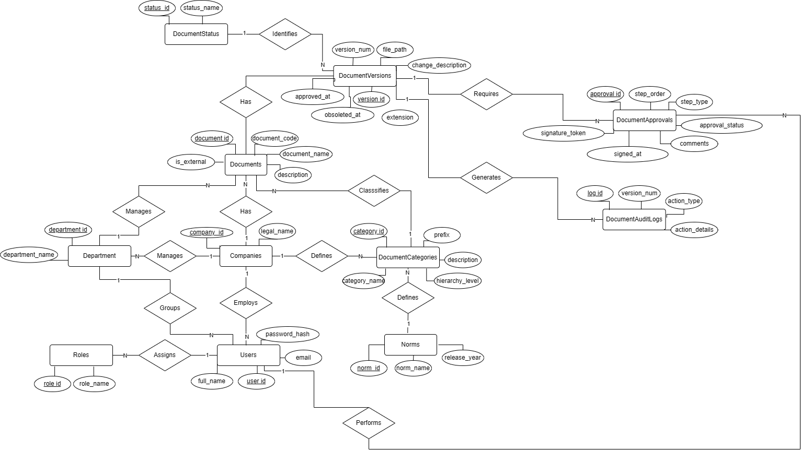

---

### 🐘 Modelo Relacional (PostgreSQL)

A diferencia de la base de datos principal en **SQL Server**, el modelo relacional implementado en **PostgreSQL** tiene una estructura ligera y especializada, enfocada exclusivamente en el almacenamiento de evidencias de acceso y trazabilidad documental.

Su propósito es registrar las acciones realizadas por los usuarios dentro del **Portal Operador (Laravel)**, permitiendo generar auditorías y evidencias de cumplimiento normativo.

---

#### 📄 Migraciones que Definen el Esquema

El esquema de PostgreSQL se construye mediante dos migraciones de Laravel:

##### 1️⃣ Creación de la tabla principal

```text
2026_05_12_014117_create_access_logs_table.php
```

Responsable de crear la tabla `access_logs` y sus columnas base.

##### 2️⃣ Incorporación de soporte Multi-Tenant

```text
2026_05_15_010630_add_company_id_to_access_logs_table.php
```

Agrega la columna `company_id` para permitir el aislamiento de registros por empresa.

---

#### 📊 Diagrama Relacional

<p align="center">
  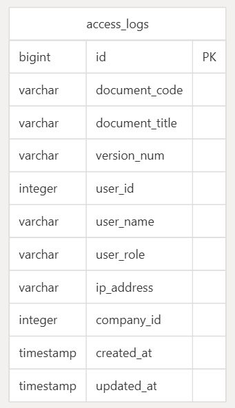
</p>

<p align="center">
  <em>Figura X. Modelo Relacional de PostgreSQL para auditoría y trazabilidad documental.</em>
</p>

---

#### 🗂️ Estructura de la Tabla `access_logs`

| Columna            | Tipo de Dato | Restricciones      | Descripción                                                  |
| ------------------ | ------------ | ------------------ | ------------------------------------------------------------ |
| **id**             | BIGINT       | PK, AUTO_INCREMENT | Identificador único del registro.                            |
| **document_code**  | VARCHAR      | INDEX              | Código del documento consultado (ej. PR-001).                |
| **document_title** | VARCHAR      | NOT NULL           | Nombre o título del documento.                               |
| **version_num**    | VARCHAR      | NOT NULL           | Versión del documento consultado.                            |
| **user_id**        | INTEGER      | NOT NULL           | Referencia lógica al usuario registrado en SQL Server.       |
| **user_name**      | VARCHAR      | NOT NULL           | Nombre completo del usuario que realizó la acción.           |
| **user_role**      | VARCHAR      | NOT NULL           | Rol del usuario al momento del acceso.                       |
| **ip_address**     | VARCHAR      | NULLABLE           | Dirección IP desde la cual se realizó la operación.          |
| **company_id**     | INTEGER      | DEFAULT 0          | Identificador lógico de la empresa propietaria del registro. |
| **created_at**     | TIMESTAMP    | NOT NULL           | Fecha y hora de creación del evento.                         |
| **updated_at**     | TIMESTAMP    | NOT NULL           | Fecha y hora de la última modificación del registro.         |

---

#### 🔗 Integración con la Arquitectura Políglota

Aunque PostgreSQL no mantiene claves foráneas físicas hacia SQL Server, la tabla `access_logs` conserva referencias lógicas mediante:

* `user_id` → Usuario registrado en SQL Server.
* `company_id` → Empresa propietaria del documento.
* `document_code` → Documento administrado por el módulo .NET.

Esta estrategia permite desacoplar los microservicios y mantener la independencia tecnológica de cada base de datos.

---

### 🍃 Esquema de Colecciones (MongoDB)

Dentro de la arquitectura políglota de **QualityDoc-Polyglot**, MongoDB actúa como el motor especializado para la indexación y recuperación rápida de documentos.

A diferencia de SQL Server y PostgreSQL, MongoDB no almacena la información transaccional completa del sistema. Su propósito es mantener un índice optimizado de documentos vigentes que permita realizar búsquedas eficientes sin afectar el rendimiento de los módulos administrativos.

---

#### 🗄️ Base de Datos y Colección

| Elemento                      | Valor                  |
| ----------------------------- | ---------------------- |
| **Base de Datos**             | `qualitydoc_metadata`  |
| **Colección**                 | `documentos_aprobados` |
| **Tecnología**                | MongoDB                |
| **Microservicio Responsable** | FastAPI (Python)       |

---

#### 🏗️ Definición del Esquema

El esquema documental se encuentra definido mediante un modelo **Pydantic** dentro del microservicio de búsqueda desarrollado con FastAPI.

```text
search/src/python-app/main.py
```

Este modelo valida la estructura de los documentos antes de ser almacenados en MongoDB.

---

#### 📊 Diagrama de la Colección


---

#### 📄 Estructura del Documento

Cada documento almacenado en la colección posee una estructura similar a la siguiente:

```json
{
  "_id": "ObjectId(...)",
  "documento_id": 42,
  "codigo": "PR-001",
  "titulo": "Procedimiento de Control de Documentos",
  "version": "2.0",
  "etiquetas": [
    "ISO",
    "Procedimientos",
    "Calidad",
    "Interno",
    "Vigente"
  ],
  "url_archivo": "/uploads/companies/1/PR-001_v2.pdf",
  "aprobado_por": "Juan Pérez",
  "empresa_id": 3,
  "departamento_id": 7,
  "fecha_indexacion": "2026-06-16T10:30:00Z"
}
```

---

#### 🗂️ Descripción de Campos

| Campo                | Tipo          | Descripción                                                |
| -------------------- | ------------- | ---------------------------------------------------------- |
| **_id**              | ObjectId      | Identificador único generado automáticamente por MongoDB.  |
| **documento_id**     | Integer       | Referencia lógica al documento almacenado en SQL Server.   |
| **codigo**           | String        | Código único del documento.                                |
| **titulo**           | String        | Nombre o título del documento.                             |
| **version**          | String        | Versión actualmente aprobada del documento.                |
| **etiquetas**        | Array[String] | Conjunto de etiquetas utilizadas para búsquedas y filtros. |
| **url_archivo**      | String        | Ruta del archivo físico almacenado en el sistema.          |
| **aprobado_por**     | String        | Nombre del aprobador final del documento.                  |
| **empresa_id**       | Integer       | Identificador de la empresa propietaria del documento.     |
| **departamento_id**  | Integer       | Departamento responsable del documento.                    |
| **fecha_indexacion** | DateTime      | Fecha y hora UTC en que el documento fue indexado.         |

---

#### 🔌 Operaciones Disponibles en la API

El microservicio FastAPI expone endpoints REST para administrar el índice documental.

| Endpoint                   | Método | Descripción                                                   |
| -------------------------- | ------ | ------------------------------------------------------------- |
| `/api/docs/index`          | POST   | Inserta o actualiza documentos dentro del índice.             |
| `/api/docs/approved`       | GET    | Recupera documentos aplicando filtros y búsquedas.            |
| `/api/docs/index/{doc_id}` | DELETE | Elimina documentos del índice cuando dejan de estar vigentes. |

---

#### ⚙️ Flujo de Indexación

```text
Documento Aprobado (.NET)
            │
            ▼
      HTTP POST
            │
            ▼
      FastAPI (Python)
            │
            ▼
 MongoDB (documentos_aprobados)
            │
            ▼
    Búsquedas de Usuarios
```

Cuando un documento alcanza el estado **Vigente**, el módulo administrativo desarrollado en ASP.NET Core envía sus metadatos al microservicio FastAPI para ser indexados.

---

#### 🔍 Características del Motor de Búsqueda

##### Upsert Automático

Si un documento ya existe en la colección y se aprueba una nueva versión, MongoDB reemplaza completamente el registro anterior mediante una operación **upsert**.

**Beneficio:** Siempre existe una única representación vigente del documento.

---

##### Búsqueda por Texto Libre

Las búsquedas utilizan expresiones regulares (`$regex`) sobre múltiples campos:

* Código del documento.
* Título.
* Etiquetas.

Esto permite localizar información utilizando palabras clave parciales.

---

##### Aislamiento Multi-Tenant

Todas las consultas son filtradas por:

```text
empresa_id
```

De esta manera, los usuarios únicamente pueden consultar documentos pertenecientes a su organización.

---

##### Referencias Lógicas

MongoDB no utiliza claves foráneas físicas.

Los siguientes campos actúan como referencias lógicas hacia SQL Server:

| Campo MongoDB   | Referencia           |
| --------------- | -------------------- |
| documento_id    | Documents.doc_id     |
| empresa_id      | Companies.company_id |
| departamento_id | Departments.dept_id  |

Esta estrategia permite mantener la independencia entre microservicios y tecnologías de persistencia.

---

##### Índice Exclusivo de Documentos Vigentes

La colección `documentos_aprobados` almacena únicamente documentos con estado:

```text
Vigente
```

Cuando un documento es:

* Revocado
* Eliminado
* Sustituido por una nueva versión

el sistema ejecuta automáticamente una operación de desindexación para retirarlo del motor de búsqueda.

---

##### Etiquetado Dinámico

Las etiquetas son generadas automáticamente desde el módulo .NET utilizando información contextual del documento:

* Norma asociada.
* Categoría documental.
* Departamento.
* Estado.
* Origen.

Esto permite mejorar significativamente la precisión de las búsquedas.

---

### 📖 Diccionario de Datos
---

> **Nota sobre campos de auditoría:** Todas las tablas de SQL Server comparten los siguientes 6 campos de auditoría. Se omiten de cada tabla individual para evitar repetición, pero están presentes en todas.

| Campo | Tipo | Default | Descripción |
|---|---|---|---|
| `status` | `NVARCHAR(20)` | `'Active'` | Estado lógico del registro: `Active`, `Inactive`, `Deleted` |
| `created_at` | `DATETIME2` | `GETUTCDATE()` | Fecha/hora UTC de creación |
| `created_by` | `INT` → FK `Users` | `NULL` | Usuario que creó el registro |
| `updated_at` | `DATETIME2` | `NULL` | Fecha/hora UTC de última modificación |
| `updated_by` | `INT` → FK `Users` | `NULL` | Usuario que modificó el registro |
| `deleted_at` | `DATETIME2` | `NULL` | Fecha/hora UTC de soft-delete |
| `deleted_by` | `INT` → FK `Users` | `NULL` | Usuario que eliminó el registro | [1](#5-0) 

---

## Base de Datos: SQL Server — `QualityDocDB`

### Tabla: `Roles`

Catálogo de roles del sistema. Define los permisos y accesos de cada tipo de usuario. [2](#5-1) 

| Campo | Tipo | PK/FK | Nulo | Restricción | Descripción |
|---|---|---|---|---|---|
| `role_id` | `INT IDENTITY(1,1)` | PK | NO | — | Identificador único del rol |
| `role_name` | `NVARCHAR(50)` | — | NO | `UNIQUE` | Nombre del rol. Valores: `Super Admin`, `Admin de Empresa`, `Creador de Doc`, `Revisor`, `Aprobador`, `Operario`, `Auditor` |

---

### Tabla: `Norms`

Catálogo de normas de calidad soportadas por el sistema. [3](#5-2) 

| Campo | Tipo | PK/FK | Nulo | Restricción | Descripción |
|---|---|---|---|---|---|
| `norm_id` | `INT IDENTITY(1,1)` | PK | NO | — | Identificador único de la norma |
| `norm_name` | `NVARCHAR(50)` | — | NO | `UNIQUE` | Nombre de la norma. Ej: `ISO 9001:2015`, `IATF 16949:2016` |
| `release_year` | `NVARCHAR(4)` | — | SÍ | — | Año de publicación de la norma. Ej: `'2015'` |

---

### Tabla: `DocumentStatus`

Catálogo de estados del ciclo de vida de una versión documental. [4](#5-3) 

| Campo | Tipo | PK/FK | Nulo | Restricción | Descripción |
|---|---|---|---|---|---|
| `status_id` | `INT IDENTITY(1,1)` | PK | NO | — | Identificador único del estado |
| `status_name` | `NVARCHAR(30)` | — | NO | `UNIQUE` | Nombre del estado. Valores semilla: `1=Borrador`, `2=En Revisión`, `3=Aprobado`, `4=Obsoleto` |

---

### Tabla: `Companies`

Empresas cliente registradas en el sistema (tenants). Cada empresa tiene sus propios datos aislados. [5](#5-4) 

| Campo | Tipo | PK/FK | Nulo | Restricción | Descripción |
|---|---|---|---|---|---|
| `company_id` | `INT IDENTITY(1,1)` | PK | NO | — | Identificador único de la empresa |
| `legal_name` | `NVARCHAR(200)` | — | NO | — | Razón social o nombre legal de la empresa |
| `tax_id` | `NVARCHAR(20)` | — | NO | `UNIQUE` | RFC o identificador fiscal único de la empresa |

---

### Tabla: `Departments`

Departamentos organizacionales dentro de cada empresa. [6](#5-5) 

| Campo | Tipo | PK/FK | Nulo | Restricción | Descripción |
|---|---|---|---|---|---|
| `dept_id` | `INT IDENTITY(1,1)` | PK | NO | — | Identificador único del departamento |
| `company_id` | `INT` | FK → `Companies` | NO | `UQ_Company_DeptName` | Empresa a la que pertenece el departamento |
| `dept_name` | `NVARCHAR(100)` | — | NO | `UNIQUE` por empresa | Nombre del departamento. Único dentro de la misma empresa |

---

### Tabla: `Users`

Usuarios del sistema con sus credenciales, rol y departamento asignado. [7](#5-6) 

| Campo | Tipo | PK/FK | Nulo | Restricción | Descripción |
|---|---|---|---|---|---|
| `user_id` | `INT IDENTITY(1,1)` | PK | NO | — | Identificador único del usuario |
| `company_id` | `INT` | FK → `Companies` | SÍ | — | Empresa a la que pertenece. `NULL` para Super Admin |
| `dept_id` | `INT` | FK → `Departments` | SÍ | — | Departamento asignado al usuario |
| `role_id` | `INT` | FK → `Roles` | NO | — | Rol del usuario en el sistema |
| `full_name` | `NVARCHAR(200)` | — | NO | — | Nombre completo del usuario |
| `email` | `NVARCHAR(150)` | — | NO | `UNIQUE` | Correo electrónico. Usado como identificador de login |
| `password_hash` | `NVARCHAR(MAX)` | — | NO | — | Hash BCrypt de la contraseña. Nunca se almacena en texto plano |
| `password_reset_token` | `NVARCHAR(255)` | — | SÍ | — | Token UUID para recuperación/configuración de contraseña |
| `reset_token_expiry` | `DATETIME2` | — | SÍ | — | Fecha de expiración del token de reset. Válido 1h (reset) o 3 días (activación) |
| `two_factor_code` | `NVARCHAR(10)` | — | SÍ | — | Código numérico de 6 dígitos para 2FA por correo |
| `two_factor_expiry` | `DATETIME2` | — | SÍ | — | Fecha de expiración del código 2FA. Válido 10 minutos |

---

### Tabla: `DocumentCategories`

Estructura jerárquica de categorías documentales ISO configurada por cada empresa. [8](#5-7) 

| Campo | Tipo | PK/FK | Nulo | Restricción | Descripción |
|---|---|---|---|---|---|
| `category_id` | `INT IDENTITY(1,1)` | PK | NO | — | Identificador único de la categoría |
| `company_id` | `INT` | FK → `Companies` | NO | `UQ_Company_Norm_CategoryName` | Empresa dueña de la categoría |
| `norm_id` | `INT` | FK → `Norms` | SÍ | `UQ_Company_Norm_CategoryName` | Norma ISO a la que pertenece la categoría |
| `category_name` | `NVARCHAR(100)` | — | NO | `UNIQUE` por empresa+norma | Nombre de la categoría. Ej: `Manual de Calidad`, `Procedimientos` |
| `prefix` | `VARCHAR(15)` | — | NO | — | Prefijo para el código de documentos. Ej: `ISO-MAN`, `PR` |
| `description` | `VARCHAR(255)` | — | SÍ | — | Descripción del propósito de la categoría |
| `hierarchy_level` | `INT` | — | NO | `CHECK (1-10)` | Nivel jerárquico dentro de la estructura ISO (1=más alto) |
| `retention_years` | `INT` | `3` | NO | `CHECK (1-99)` | Años de retención obligatoria de documentos según norma ISO |

---

### Tabla: `Documents`

Documentos maestros del sistema. Cada documento puede tener múltiples versiones. [9](#5-8) 

| Campo | Tipo | PK/FK | Nulo | Restricción | Descripción |
|---|---|---|---|---|---|
| `doc_id` | `INT IDENTITY(1,1)` | PK | NO | — | Identificador único del documento |
| `company_id` | `INT` | FK → `Companies` | NO | `UQ_DocCode_Per_Company` | Empresa dueña del documento |
| `category_id` | `INT` | FK → `DocumentCategories` | NO | — | Categoría ISO a la que pertenece el documento |
| `dept_id` | `INT` | FK → `Departments` | NO | — | Departamento responsable (dueño) del documento |
| `doc_code` | `NVARCHAR(50)` | — | NO | `UNIQUE` por empresa | Código único del documento dentro de la empresa. Ej: `PR-001` |
| `doc_name` | `NVARCHAR(255)` | — | NO | — | Nombre o título del documento |
| `description` | `NVARCHAR(MAX)` | — | SÍ | — | Descripción del contenido o propósito del documento |
| `is_external` | `BIT` | `0` | NO | — | `0` = Documento interno, `1` = Documento externo (de proveedor o cliente) |

---

### Tabla: `DocumentVersions`

Versiones de cada documento. Cada versión tiene su propio archivo y ciclo de aprobación. [10](#5-9) 

| Campo | Tipo | PK/FK | Nulo | Restricción | Descripción |
|---|---|---|---|---|---|
| `version_id` | `INT IDENTITY(1,1)` | PK | NO | — | Identificador único de la versión |
| `doc_id` | `INT` | FK → `Documents` | NO | — | Documento al que pertenece esta versión |
| `status_id` | `INT` | FK → `DocumentStatus` | NO | — | Estado actual: `1=Borrador`, `2=En Revisión`, `3=Aprobado`, `4=Obsoleto` |
| `version_num` | `NVARCHAR(10)` | — | NO | — | Número de versión. Ej: `0.1`, `1.0`, `2.3` |
| `file_path` | `NVARCHAR(MAX)` | — | NO | — | Ruta relativa al archivo en el volumen compartido Docker |
| `extension` | `NVARCHAR(10)` | — | NO | — | Extensión del archivo. Ej: `pdf`, `docx` |
| `change_description` | `NVARCHAR(MAX)` | — | SÍ | — | Motivo del cambio o descripción de las modificaciones respecto a la versión anterior |
| `approved_at` | `DATETIME2` | `NULL` | SÍ | — | Fecha/hora UTC en que la versión fue aprobada (Paso 2 completado) |
| `obsoleted_at` | `DATETIME2` | `NULL` | SÍ | — | Fecha/hora UTC en que la versión fue marcada como obsoleta por el trigger `trg_HandleDocumentObsolescence` |

---

### Tabla: `DocumentApprovals`

Registro de cada firma dentro del flujo de aprobación. Una versión tiene máximo 2 registros (Revisor + Aprobador). [11](#5-10) 

| Campo | Tipo | PK/FK | Nulo | Restricción | Descripción |
|---|---|---|---|---|---|
| `approval_id` | `INT IDENTITY(1,1)` | PK | NO | — | Identificador único del registro de firma |
| `version_id` | `INT` | FK → `DocumentVersions` | NO | — | Versión del documento que se está aprobando |
| `approver_id` | `INT` | FK → `Users` | NO | — | Usuario responsable de firmar este paso |
| `step_order` | `INT` | — | NO | — | Orden del paso en el flujo: `1=Revisor`, `2=Aprobador` |
| `step_type` | `NVARCHAR(30)` | — | NO | `CHECK ('Elaboró','Revisó','Aprobó')` | Tipo de firma según la nomenclatura ISO |
| `approval_status` | `NVARCHAR(20)` | `'Pending'` | NO | `CHECK ('Pending','Approved','Rejected')` | Estado de la decisión del firmante |
| `comments` | `NVARCHAR(MAX)` | — | SÍ | — | Observaciones del firmante. Obligatorio si `approval_status = 'Rejected'` |
| `signature_token` | `NVARCHAR(MAX)` | — | SÍ | — | Token UUID generado al momento de firmar. Evidencia legal de la firma electrónica |
| `signed_at` | `DATETIME2` | `NULL` | SÍ | — | Fecha/hora UTC exacta en que se emitió la firma |

---

### Tabla: `DocumentAuditLogs`

Bitácora permanente e inmutable de todas las acciones sobre documentos. No se elimina físicamente. [12](#5-11) 

| Campo | Tipo | PK/FK | Nulo | Restricción | Descripción |
|---|---|---|---|---|---|
| `log_id` | `INT IDENTITY(1,1)` | PK | NO | — | Identificador único del registro de bitácora |
| `company_id` | `INT` | FK → `Companies` | NO | — | Empresa a la que pertenece el evento (clave multi-tenant) |
| `doc_id` | `INT` | FK → `Documents` | NO | — | Documento sobre el que se realizó la acción |
| `version_id` | `INT` | FK → `DocumentVersions` | NO | — | Versión específica involucrada en la acción |
| `version_num` | `NVARCHAR(10)` | — | NO | — | Foto del número de versión al momento del evento (desnormalizado para inmutabilidad) |
| `action_type` | `NVARCHAR(50)` | — | NO | — | Tipo de acción. Valores: `DraftCreated`, `DraftEdited`, `SentToReview`, `Approved`, `Rejected`, `Recalled`, `NewVersionCreated` |
| `action_details` | `NVARCHAR(MAX)` | — | SÍ | — | Texto descriptivo del evento para lectura humana en la bitácora |

---

### Tabla: `DocumentIssues`

Tickets de incidencias o no conformidades reportadas sobre documentos. [13](#5-12) 

| Campo | Tipo | PK/FK | Nulo | Restricción | Descripción |
|---|---|---|---|---|---|
| `issue_id` | `INT IDENTITY(1,1)` | PK | NO | — | Identificador único del ticket |
| `company_id` | `INT` | FK → `Companies` | NO | — | Empresa que reporta la incidencia |
| `doc_code` | `NVARCHAR(50)` | — | NO | — | Código del documento afectado (referencia lógica, no FK) |
| `issue_type` | `NVARCHAR(100)` | — | NO | — | Tipo de incidencia. Ej: `Error de contenido`, `Versión incorrecta` |
| `details` | `NVARCHAR(MAX)` | — | NO | — | Descripción detallada del problema reportado |
| `reported_by` | `INT` | FK → `Users` | NO | — | Usuario que reportó la incidencia |
| `issue_status` | `NVARCHAR(30)` | `'Pending'` | NO | `CHECK ('Pending','In Review','Resolved')` | Estado de atención del ticket |

---

## Base de Datos: PostgreSQL — `audit_db`

### Tabla: `access_logs`

Registro de todos los accesos y firmas de enterado de los operarios. Base de datos exclusiva del portal Laravel. [14](#5-13) [15](#5-14) 

| Campo | Tipo | PK/FK | Nulo | Restricción | Descripción |
|---|---|---|---|---|---|
| `id` | `BIGINT` | PK | NO | `AUTOINCREMENT` | Identificador único del registro de acceso |
| `document_code` | `VARCHAR` | — | NO | `INDEX` | Código del documento consultado. Ej: `PR-001`. Indexado para consultas de reportes |
| `document_title` | `VARCHAR` | — | NO | — | Título del documento o descripción de la acción. Prefijo `[FIRMA DE ENTERADO]` para acuses |
| `version_num` | `VARCHAR` | — | NO | — | Número de versión del documento al momento del acceso |
| `user_id` | `INTEGER` | Ref. lógica → `Users.user_id` (SQL Server) | NO | — | ID del usuario que realizó la acción |
| `user_name` | `VARCHAR` | — | NO | — | Nombre del usuario (desnormalizado para inmutabilidad del log) |
| `user_role` | `VARCHAR` | — | NO | — | Rol del usuario al momento del acceso (desnormalizado) |
| `ip_address` | `VARCHAR` | — | SÍ | — | Dirección IP desde donde se realizó el acceso |
| `company_id` | `INTEGER` | Ref. lógica → `Companies.company_id` (SQL Server) | NO | `DEFAULT 0` | ID de la empresa del usuario. Clave de aislamiento multi-tenant |
| `created_at` | `TIMESTAMP` | — | NO | — | Fecha/hora del evento (zona horaria `America/Monterrey`) |
| `updated_at` | `TIMESTAMP` | — | NO | — | Última actualización del registro |

---

## Base de Datos: MongoDB — `qualitydoc_metadata`

### Colección: `documentos_aprobados`

Índice de búsqueda de documentos vigentes. Se sincroniza automáticamente desde SQL Server al aprobar o revocar documentos. [16](#5-15) 

| Campo | Tipo BSON | Nulo | Descripción |
|---|---|---|---|
| `_id` | `ObjectId` | NO | Llave primaria generada automáticamente por MongoDB |
| `documento_id` | `Int32` | NO | Referencia lógica a `Documents.doc_id` en SQL Server. Clave de upsert |
| `codigo` | `String` | NO | Código único del documento. Ej: `PR-001` |
| `titulo` | `String` | NO | Nombre del documento |
| `version` | `String` | NO | Número de versión aprobada. Ej: `"2.0"` |
| `etiquetas` | `Array<String>` | NO | Array de 5 tags para búsqueda: `[normativa, categoría, departamento, origen, estado]`. Ej: `["ISO", "Procedimientos", "Calidad", "Interno", "Vigente"]` |
| `url_archivo` | `String` | NO | Ruta relativa al archivo PDF en el volumen compartido Docker |
| `aprobado_por` | `String` | NO | Nombre del aprobador final (desnormalizado) |
| `empresa_id` | `Int32` | NO | Referencia lógica a `Companies.company_id`. Filtro de multi-tenancy en todas las consultas |
| `departamento_id` | `Int32` | NO | Referencia lógica a `Departments.dept_id`. Permite filtrar por departamento |
| `fecha_indexacion` | `Date` | NO | Timestamp UTC de cuando el documento fue indexado o re-indexado en MongoDB | [17](#5-16) 

---

## Resumen de Índices (SQL Server) [18](#5-17) 

| Índice | Tabla | Columnas | Tipo | Propósito |
|---|---|---|---|---|
| `IX_Users_Login` | `Users` | `email, status` | Normal | Acelerar el login |
| `IX_Docs_Company_Status` | `Documents` | `company_id, status` | Normal | Filtrar documentos por empresa |
| `IX_Versions_Doc_Status` | `DocumentVersions` | `doc_id, status_id, status` | Normal | Consultas de versiones por estado |
| `UIX_Docs_Code_Company` | `Documents` | `company_id, doc_code` | `UNIQUE` filtrado | Unicidad de código por empresa, excluyendo eliminados |
| `IX_Approvals_Pending` | `DocumentApprovals` | `approver_id, approval_status` | Normal | Bandeja de firmas pendientes |
| `IX_AuditLogs_Version` | `DocumentAuditLogs` | `company_id, doc_id, version_id, created_at` | Normal | Consultas de bitácora por versión |


---

Basado en toda la información recopilada del sistema, aquí está el Diagrama de Casos de Uso completo:

---

## Diagrama de Casos de Uso — QualityDoc-Polyglot

### Subsistema 1: Autenticación (Todos los actores)

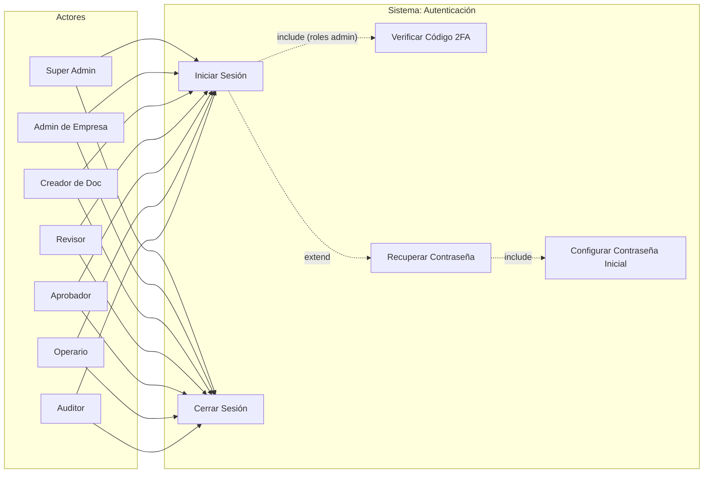
```mermaid
graph LR
    subgraph "Actores"
        SA["Super Admin"]
        AE["Admin de Empresa"]
        CD["Creador de Doc"]
        RE["Revisor"]
        AP["Aprobador"]
        OP["Operario"]
        AU["Auditor"]
    end

    subgraph "Sistema: Autenticación"
        UC1["Iniciar Sesión"]
        UC2["Verificar Código 2FA"]
        UC3["Recuperar Contraseña"]
        UC4["Configurar Contraseña Inicial"]
        UC5["Cerrar Sesión"]
    end

    SA --> UC1
    AE --> UC1
    CD --> UC1
    RE --> UC1
    AP --> UC1
    OP --> UC1
    AU --> UC1

    UC1 -.->|"include (roles admin)"| UC2
    UC1 -.->|"extend"| UC3
    UC3 -.->|"include"| UC4
    SA --> UC5
    AE --> UC5
    CD --> UC5
    RE --> UC5
    AP --> UC5
    OP --> UC5
    AU --> UC5
``` 

---

### Subsistema 2: Gestión Global (Super Admin)

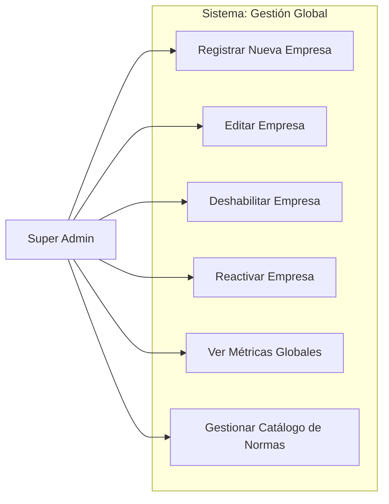
```mermaid
graph LR
    SA["Super Admin"]

    subgraph "Sistema: Gestión Global"
        UC10["Registrar Nueva Empresa"]
        UC11["Editar Empresa"]
        UC12["Deshabilitar Empresa"]
        UC13["Reactivar Empresa"]
        UC14["Ver Métricas Globales"]
        UC15["Gestionar Catálogo de Normas"]
    end

    SA --> UC10
    SA --> UC11
    SA --> UC12
    SA --> UC13
    SA --> UC14
    SA --> UC15
```

---

### Subsistema 3: Administración de Empresa (Admin de Empresa)

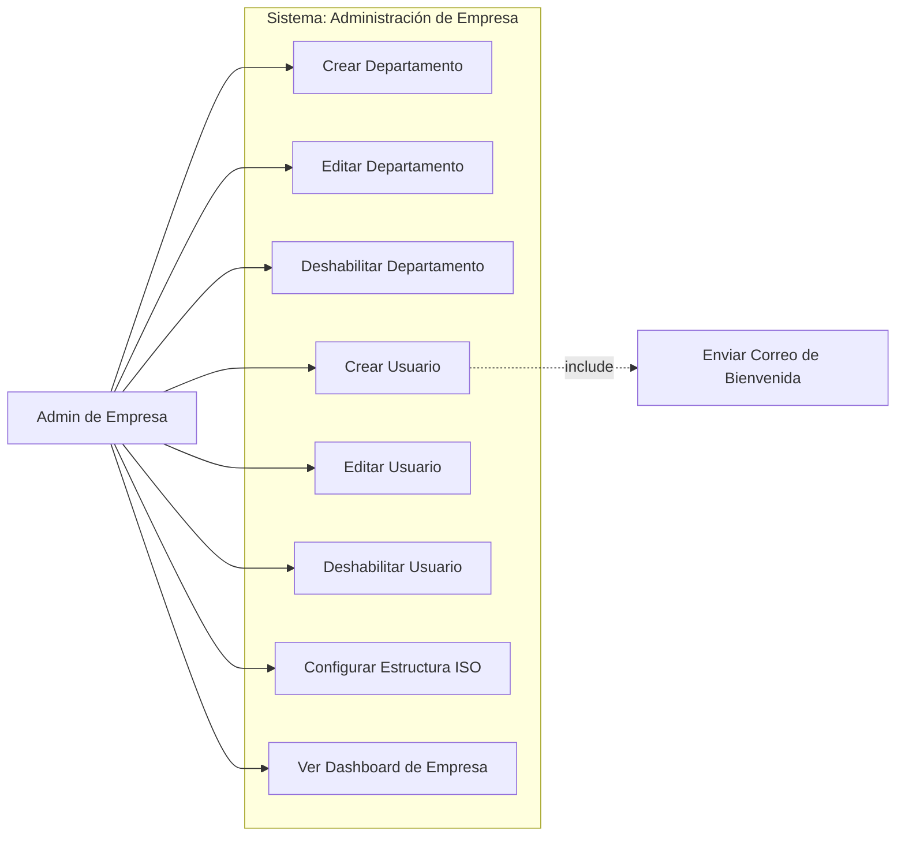
```mermaid
graph LR
    AE["Admin de Empresa"]

    subgraph "Sistema: Administración de Empresa"
        UC20["Crear Departamento"]
        UC21["Editar Departamento"]
        UC22["Deshabilitar Departamento"]
        UC23["Crear Usuario"]
        UC24["Editar Usuario"]
        UC25["Deshabilitar Usuario"]
        UC26["Configurar Estructura ISO"]
        UC27["Ver Dashboard de Empresa"]
    end

    AE --> UC20
    AE --> UC21
    AE --> UC22
    AE --> UC23
    AE --> UC24
    AE --> UC25
    AE --> UC26
    AE --> UC27

    UC23 -.->|"include"| UC28["Enviar Correo de Bienvenida"]
``` 

---

### Subsistema 4: Control Documental (Creador de Doc)

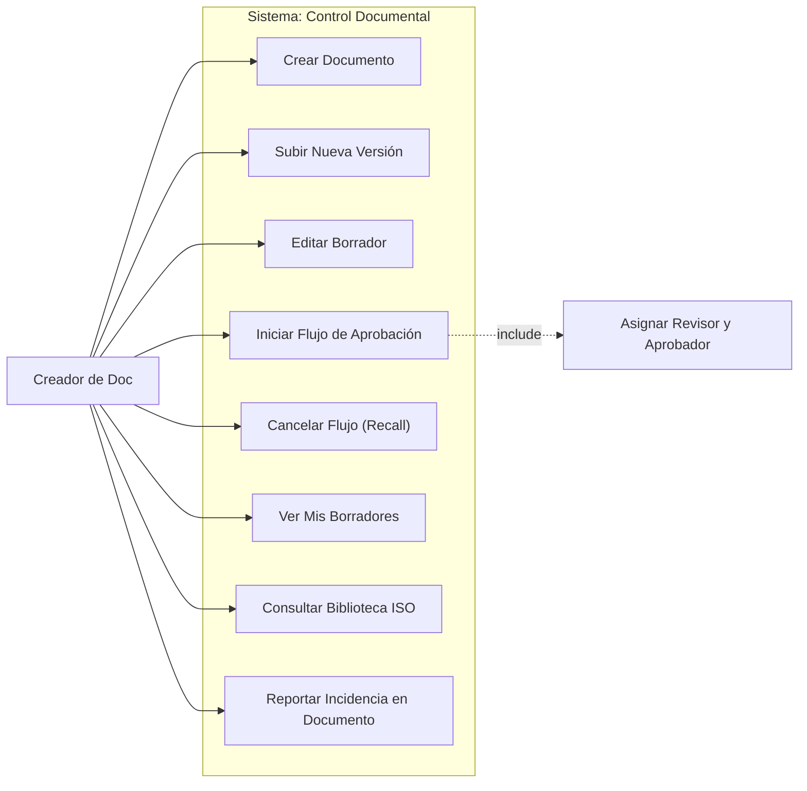
```mermaid
graph LR
    CD["Creador de Doc"]

    subgraph "Sistema: Control Documental"
        UC30["Crear Documento"]
        UC31["Subir Nueva Versión"]
        UC32["Editar Borrador"]
        UC33["Iniciar Flujo de Aprobación"]
        UC34["Cancelar Flujo (Recall)"]
        UC35["Ver Mis Borradores"]
        UC36["Consultar Biblioteca ISO"]
        UC37["Reportar Incidencia en Documento"]
    end

    CD --> UC30
    CD --> UC31
    CD --> UC32
    CD --> UC33
    CD --> UC34
    CD --> UC35
    CD --> UC36
    CD --> UC37

    UC33 -.->|"include"| UC38["Asignar Revisor y Aprobador"]
``` 

---

### Subsistema 5: Flujo de Aprobación (Revisor y Aprobador)

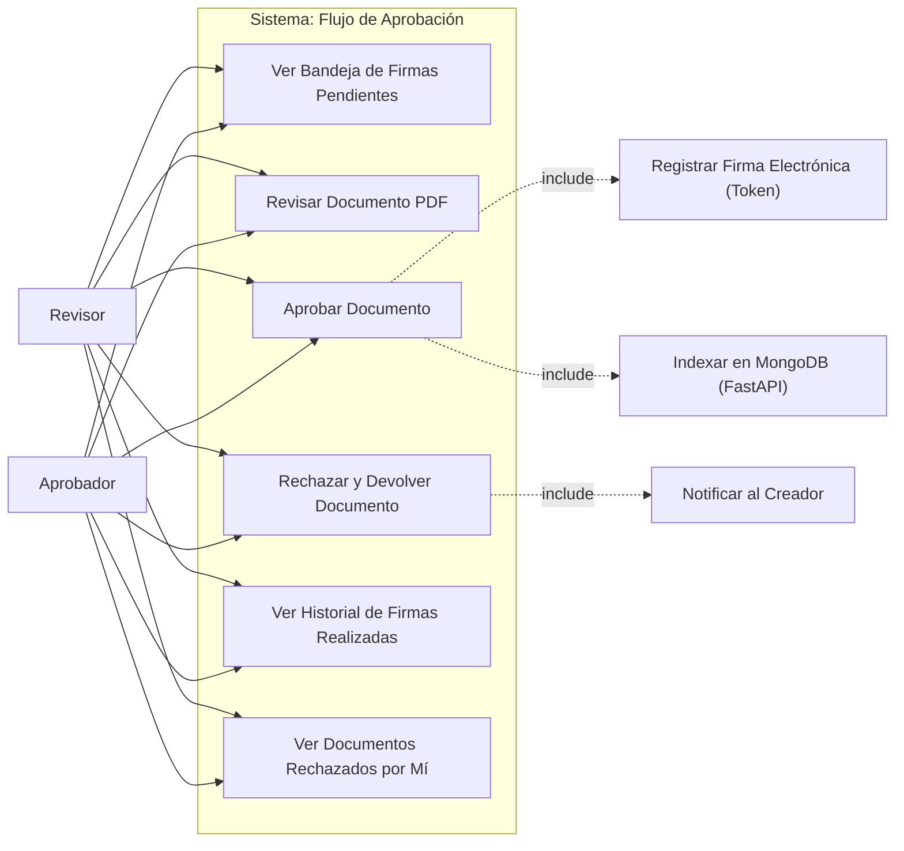
```mermaid
graph LR
    RE["Revisor"]
    AP["Aprobador"]

    subgraph "Sistema: Flujo de Aprobación"
        UC40["Ver Bandeja de Firmas Pendientes"]
        UC41["Revisar Documento PDF"]
        UC42["Aprobar Documento"]
        UC43["Rechazar y Devolver Documento"]
        UC44["Ver Historial de Firmas Realizadas"]
        UC45["Ver Documentos Rechazados por Mí"]
    end

    RE --> UC40
    RE --> UC41
    RE --> UC42
    RE --> UC43
    RE --> UC44
    RE --> UC45

    AP --> UC40
    AP --> UC41
    AP --> UC42
    AP --> UC43
    AP --> UC44
    AP --> UC45

    UC42 -.->|"include"| UC46["Registrar Firma Electrónica (Token)"]
    UC42 -.->|"include"| UC47["Indexar en MongoDB (FastAPI)"]
    UC43 -.->|"include"| UC48["Notificar al Creador"]
``` 

---

### Subsistema 6: Portal Operario

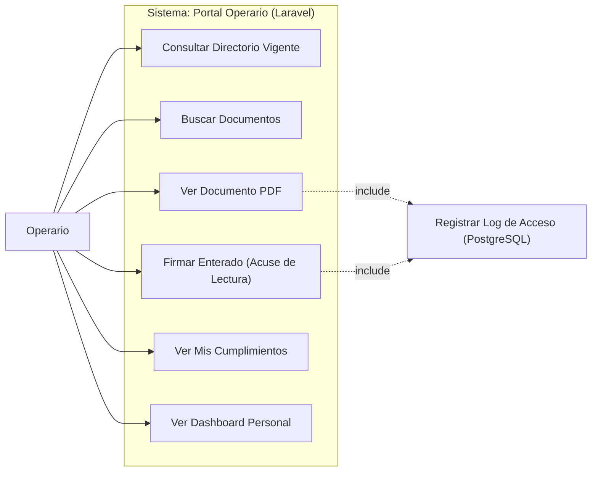
```mermaid
graph LR
    OP["Operario"]

    subgraph "Sistema: Portal Operario (Laravel)"
        UC50["Consultar Directorio Vigente"]
        UC51["Buscar Documentos"]
        UC52["Ver Documento PDF"]
        UC53["Firmar Enterado (Acuse de Lectura)"]
        UC54["Ver Mis Cumplimientos"]
        UC55["Ver Dashboard Personal"]
    end

    OP --> UC50
    OP --> UC51
    OP --> UC52
    OP --> UC53
    OP --> UC54
    OP --> UC55

    UC52 -.->|"include"| UC56["Registrar Log de Acceso (PostgreSQL)"]
    UC53 -.->|"include"| UC56
``` 

---

### Subsistema 7: Auditoría

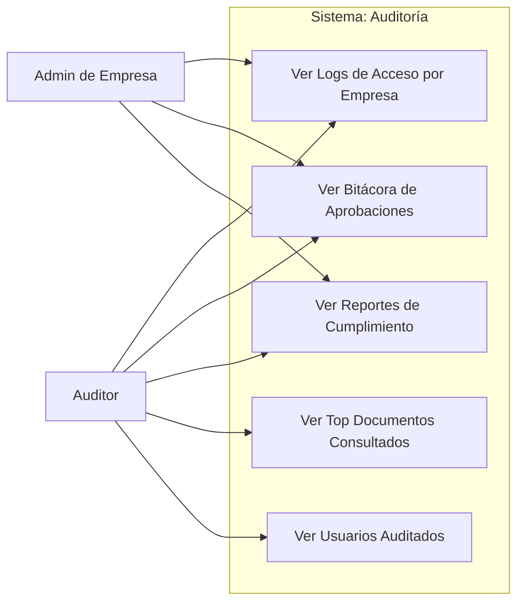
```mermaid
graph LR
    AU["Auditor"]
    AE["Admin de Empresa"]

    subgraph "Sistema: Auditoría"
        UC60["Ver Logs de Acceso por Empresa"]
        UC61["Ver Bitácora de Aprobaciones"]
        UC62["Ver Reportes de Cumplimiento"]
        UC63["Ver Top Documentos Consultados"]
        UC64["Ver Usuarios Auditados"]
    end

    AU --> UC60
    AU --> UC61
    AU --> UC62
    AU --> UC63
    AU --> UC64

    AE --> UC60
    AE --> UC61
    AE --> UC62
``` 

---

### Subsistema 8: Motor de Búsqueda (FastAPI — interno)

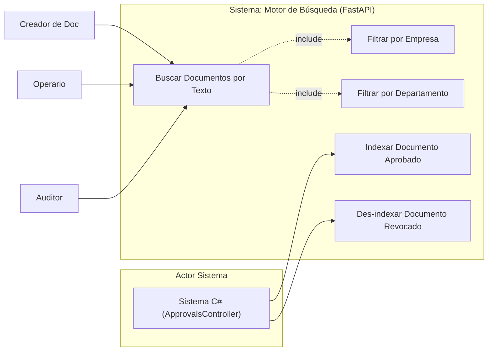
```mermaid
graph LR
    CD["Creador de Doc"]
    OP["Operario"]
    AU["Auditor"]

    subgraph "Sistema: Motor de Búsqueda (FastAPI)"
        UC70["Buscar Documentos por Texto"]
        UC71["Filtrar por Empresa"]
        UC72["Filtrar por Departamento"]
        UC73["Indexar Documento Aprobado"]
        UC74["Des-indexar Documento Revocado"]
    end

    CD --> UC70
    OP --> UC70
    AU --> UC70

    UC70 -.->|"include"| UC71
    UC70 -.->|"include"| UC72

    subgraph "Actor Sistema"
        SYS["Sistema C# (ApprovalsController)"]
    end

    SYS --> UC73
    SYS --> UC74
``` 

---

## Resumen de Actores y Casos de Uso

| Actor | Cantidad de CU | Subsistemas |
|---|---|---|
| **Super Admin** | 6 | Autenticación, Gestión Global |
| **Admin de Empresa** | 9 | Autenticación, Administración, Auditoría |
| **Creador de Doc** | 8 | Autenticación, Control Documental, Búsqueda |
| **Revisor** | 6 | Autenticación, Flujo de Aprobación |
| **Aprobador** | 6 | Autenticación, Flujo de Aprobación |
| **Operario** | 6 | Autenticación, Portal Operario, Búsqueda |
| **Auditor** | 6 | Autenticación, Auditoría, Búsqueda |
| **Sistema C#** | 2 | Motor de Búsqueda (actor secundario) |

Los roles definidos en la base de datos son la fuente de verdad para los actores del sistema. 

---

### ⚙️ Diagrama de Clases (.NET)

---

## Parte 1: Capa de Modelos (Domain Layer)

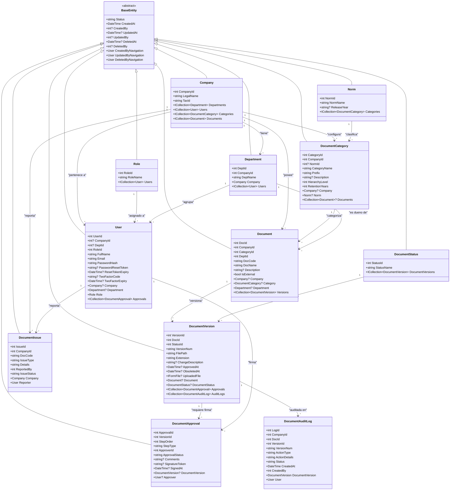
```mermaid
classDiagram
    class BaseEntity {
        <<abstract>>
        +string Status
        +DateTime CreatedAt
        +int? CreatedBy
        +DateTime? UpdatedAt
        +int? UpdatedBy
        +DateTime? DeletedAt
        +int? DeletedBy
        +User CreatedByNavigation
        +User UpdatedByNavigation
        +User DeletedByNavigation
    }

    class Role {
        +int RoleId
        +string RoleName
        +ICollection~User~ Users
    }

    class Norm {
        +int NormId
        +string NormName
        +string? ReleaseYear
        +ICollection~DocumentCategory~ Categories
    }

    class DocumentStatus {
        +int StatusId
        +string StatusName
        +ICollection~DocumentVersion~ DocumentVersions
    }

    class Company {
        +int CompanyId
        +string LegalName
        +string TaxId
        +ICollection~Department~ Departments
        +ICollection~User~ Users
        +ICollection~DocumentCategory~ Categories
        +ICollection~Document~ Documents
    }

    class Department {
        +int DeptId
        +int CompanyId
        +string DeptName
        +Company Company
        +ICollection~User~ Users
    }

    class User {
        +int UserId
        +int? CompanyId
        +int? DeptId
        +int RoleId
        +string FullName
        +string Email
        +string PasswordHash
        +string? PasswordResetToken
        +DateTime? ResetTokenExpiry
        +string? TwoFactorCode
        +DateTime? TwoFactorExpiry
        +Company? Company
        +Department? Department
        +Role Role
        +ICollection~DocumentApproval~ Approvals
    }

    class DocumentCategory {
        +int CategoryId
        +int CompanyId
        +int? NormId
        +string CategoryName
        +string Prefix
        +string? Description
        +int HierarchyLevel
        +int RetentionYears
        +Company? Company
        +Norm? Norm
        +ICollection~Document~? Documents
    }

    class Document {
        +int DocId
        +int CompanyId
        +int CategoryId
        +int DeptId
        +string DocCode
        +string DocName
        +string? Description
        +bool IsExternal
        +Company? Company
        +DocumentCategory? Category
        +Department? Department
        +ICollection~DocumentVersion~ Versions
    }

    class DocumentVersion {
        +int VersionId
        +int DocId
        +int StatusId
        +string VersionNum
        +string FilePath
        +string Extension
        +string? ChangeDescription
        +DateTime? ApprovedAt
        +DateTime? ObsoletedAt
        +IFormFile? UploadedFile
        +Document? Document
        +DocumentStatus? DocumentStatus
        +ICollection~DocumentApproval~ Approvals
        +ICollection~DocumentAuditLog~ AuditLogs
    }

    class DocumentApproval {
        +int ApprovalId
        +int VersionId
        +int StepOrder
        +string StepType
        +int ApproverId
        +string ApprovalStatus
        +string? Comments
        +string? SignatureToken
        +DateTime? SignedAt
        +DocumentVersion? DocumentVersion
        +User? Approver
    }

    class DocumentAuditLog {
        +int LogId
        +int CompanyId
        +int DocId
        +int VersionId
        +string VersionNum
        +string ActionType
        +string ActionDetails
        +string Status
        +DateTime CreatedAt
        +int CreatedBy
        +DocumentVersion DocumentVersion
        +User User
    }

    class DocumentIssue {
        +int IssueId
        +int CompanyId
        +string DocCode
        +string IssueType
        +string Details
        +int ReportedBy
        +string IssueStatus
        +Company Company
        +User Reporter
    }

    BaseEntity <|-- Role
    BaseEntity <|-- Norm
    BaseEntity <|-- DocumentStatus
    BaseEntity <|-- Company
    BaseEntity <|-- Department
    BaseEntity <|-- User
    BaseEntity <|-- DocumentCategory
    BaseEntity <|-- Document
    BaseEntity <|-- DocumentVersion
    BaseEntity <|-- DocumentApproval
    BaseEntity <|-- DocumentIssue

    Company "1" --> "*" Department : "tiene"
    Company "1" --> "*" User : "pertenece a"
    Company "1" --> "*" DocumentCategory : "configura"
    Company "1" --> "*" Document : "posee"
    Company "1" --> "*" DocumentIssue : "reporta"
    Role "1" --> "*" User : "asignado a"
    Department "1" --> "*" User : "agrupa"
    Norm "1" --> "*" DocumentCategory : "clasifica"
    DocumentCategory "1" --> "*" Document : "categoriza"
    Department "1" --> "*" Document : "es dueno de"
    Document "1" --> "*" DocumentVersion : "versiona"
    DocumentStatus "1" --> "*" DocumentVersion : "define estado"
    DocumentVersion "1" --> "*" DocumentApproval : "requiere firma"
    DocumentVersion "1" --> "*" DocumentAuditLog : "auditada en"
    User "1" --> "*" DocumentApproval : "firma"
    User "1" --> "*" DocumentIssue : "reporta"
``` 

> `DocumentAuditLog` es la única entidad que **no hereda** de `BaseEntity` — tiene sus propios campos de auditoría mínimos para garantizar inmutabilidad del log.

---

## Parte 2: Capa de Servicios, Datos y Controladores

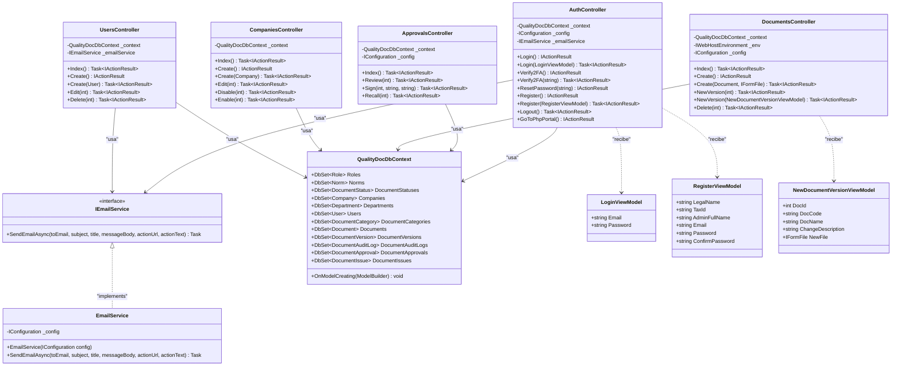
```mermaid
classDiagram
    class IEmailService {
        <<interface>>
        +SendEmailAsync(toEmail, subject, title, messageBody, actionUrl, actionText) Task
    }

    class EmailService {
        -IConfiguration _config
        +EmailService(IConfiguration config)
        +SendEmailAsync(toEmail, subject, title, messageBody, actionUrl, actionText) Task
    }

    class QualityDocDbContext {
        +DbSet~Role~ Roles
        +DbSet~Norm~ Norms
        +DbSet~DocumentStatus~ DocumentStatuses
        +DbSet~Company~ Companies
        +DbSet~Department~ Departments
        +DbSet~User~ Users
        +DbSet~DocumentCategory~ DocumentCategories
        +DbSet~Document~ Documents
        +DbSet~DocumentVersion~ DocumentVersions
        +DbSet~DocumentAuditLog~ DocumentAuditLogs
        +DbSet~DocumentApproval~ DocumentApprovals
        +DbSet~DocumentIssue~ DocumentIssues
        +OnModelCreating(ModelBuilder) void
    }

    class LoginViewModel {
        +string Email
        +string Password
    }

    class RegisterViewModel {
        +string LegalName
        +string TaxId
        +string AdminFullName
        +string Email
        +string Password
        +string ConfirmPassword
    }

    class NewDocumentVersionViewModel {
        +int DocId
        +string DocCode
        +string DocName
        +string ChangeDescription
        +IFormFile NewFile
    }

    class AuthController {
        -QualityDocDbContext _context
        -IConfiguration _config
        -IEmailService _emailService
        +Login() IActionResult
        +Login(LoginViewModel) Task~IActionResult~
        +Verify2FA() IActionResult
        +Verify2FA(string) Task~IActionResult~
        +ResetPassword(string) IActionResult
        +Register() IActionResult
        +Register(RegisterViewModel) Task~IActionResult~
        +Logout() Task~IActionResult~
        +GoToPhpPortal() IActionResult
    }

    class ApprovalsController {
        -QualityDocDbContext _context
        -IConfiguration _config
        +Index() Task~IActionResult~
        +Review(int) Task~IActionResult~
        +Sign(int, string, string) Task~IActionResult~
        +Recall(int) Task~IActionResult~
    }

    class DocumentsController {
        -QualityDocDbContext _context
        -IWebHostEnvironment _env
        -IConfiguration _config
        +Index() Task~IActionResult~
        +Create() IActionResult
        +Create(Document, IFormFile) Task~IActionResult~
        +NewVersion(int) Task~IActionResult~
        +NewVersion(NewDocumentVersionViewModel) Task~IActionResult~
        +Delete(int) Task~IActionResult~
    }

    class CompaniesController {
        -QualityDocDbContext _context
        +Index() Task~IActionResult~
        +Create() IActionResult
        +Create(Company) Task~IActionResult~
        +Edit(int) Task~IActionResult~
        +Disable(int) Task~IActionResult~
        +Enable(int) Task~IActionResult~
    }

    class UsersController {
        -QualityDocDbContext _context
        -IEmailService _emailService
        +Index() Task~IActionResult~
        +Create() IActionResult
        +Create(User) Task~IActionResult~
        +Edit(int) Task~IActionResult~
        +Delete(int) Task~IActionResult~
    }

    IEmailService <|.. EmailService : "implements"

    AuthController --> QualityDocDbContext : "usa"
    AuthController --> IEmailService : "usa"
    AuthController ..> LoginViewModel : "recibe"
    AuthController ..> RegisterViewModel : "recibe"

    ApprovalsController --> QualityDocDbContext : "usa"

    DocumentsController --> QualityDocDbContext : "usa"
    DocumentsController ..> NewDocumentVersionViewModel : "recibe"

    CompaniesController --> QualityDocDbContext : "usa"

    UsersController --> QualityDocDbContext : "usa"
    UsersController --> IEmailService : "usa"
``` 
---

## Notas del diseño

| Aspecto | Detalle |
|---|---|
| **Herencia** | `BaseEntity` es la clase abstracta base de 11 de las 12 entidades. Centraliza los 7 campos de auditoría y las 3 navegaciones de auditoría.  |
| **Filtros globales** | `QualityDocDbContext` aplica `HasQueryFilter` en 8 entidades para implementar soft-delete automático en todas las consultas LINQ.   |
| **`[NotMapped]`** | `DocumentVersion.UploadedFile` es de tipo `IFormFile` y está marcado con `[NotMapped]` — existe solo en memoria para recibir el archivo del formulario, nunca se persiste.   |
| **Inyección de dependencias** | Los controladores reciben `QualityDocDbContext` e `IEmailService` por constructor (DI de ASP.NET Core). `AuthController` y `UsersController` son los únicos que dependen del servicio de correo.   |
| **Triggers registrados** | El `DbContext` registra 3 triggers de SQL Server (`trg_HandleDocumentObsolescence`, `trg_Users_UpdateTimestamp`, `trg_UpdateDocumentTimestamp`) para que EF Core no use `OUTPUT` en esas tablas.   |
| **ViewModels** | `LoginViewModel` y `RegisterViewModel` están en `QualityDoc.API.ViewModels`. `NewDocumentVersionViewModel` está en `QualityDoc.API.Models` (namespace diferente).


---

### 🔄 Diagrama de Secuencia (Flujo de carga y aprobación de un documento).


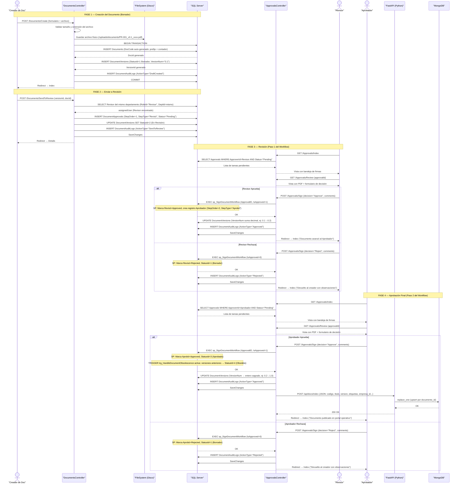
```mermaid
sequenceDiagram
    actor Creador as "Creador de Doc"
    participant DC as "DocumentsController"
    participant FS as "FileSystem (Disco)"
    participant DB as "SQL Server"
    participant AC as "ApprovalsController"
    actor Revisor as "Revisor"
    actor Aprobador as "Aprobador"
    participant PY as "FastAPI (Python)"
    participant MG as "MongoDB"

    Note over Creador,DB: FASE 1 — Creación del Documento (Borrador)

    Creador->>DC: POST /Documents/Create (formulario + archivo)
    DC->>DC: Validar tamaño y extensión del archivo
    DC->>FS: Guardar archivo físico (/uploads/documents/PR-001_v0.1_xxxx.pdf)
    DC->>DB: BEGIN TRANSACTION
    DC->>DB: INSERT Documents (DocCode auto-generado: prefijo + contador)
    DB-->>DC: DocId generado
    DC->>DB: INSERT DocumentVersions (StatusId=1 Borrador, VersionNum="0.1")
    DB-->>DC: VersionId generado
    DC->>DB: INSERT DocumentAuditLogs (ActionType="DraftCreated")
    DC->>DB: COMMIT
    DC-->>Creador: Redirect → Index

    Note over Creador,DB: FASE 2 — Enviar a Revisión

    Creador->>DC: POST /Documents/SendToReview (versionId, docId)
    DC->>DB: SELECT Revisor del mismo departamento (RoleId="Revisor", DeptId=mismo)
    DB-->>DC: assignedUser (Revisor encontrado)
    DC->>DB: INSERT DocumentApprovals (StepOrder=1, StepType="Revisó", Status="Pending")
    DC->>DB: UPDATE DocumentVersions SET StatusId=2 (En Revisión)
    DC->>DB: INSERT DocumentAuditLogs (ActionType="SentToReview")
    DC->>DB: SaveChanges
    DC-->>Creador: Redirect → Details

    Note over Revisor,DB: FASE 3 — Revisión (Paso 1 del Workflow)

    Revisor->>AC: GET /Approvals/Index
    AC->>DB: SELECT Approvals WHERE ApproverId=Revisor AND Status="Pending"
    DB-->>AC: Lista de tareas pendientes
    AC-->>Revisor: Vista con bandeja de firmas
    Revisor->>AC: GET /Approvals/Review (approvalId)
    AC-->>Revisor: Vista con PDF + formulario de decisión

    alt Revisor Aprueba
        Revisor->>AC: POST /Approvals/Sign (decision="Approve", comments)
        AC->>DB: EXEC sp_SignDocumentWorkflow (ApprovalID, IsApproved=1)
        Note over DB: SP: Marca Revisó=Approved, crea registro Aprobador (StepOrder=2, StepType="Aprobó")
        DB-->>AC: OK
        AC->>DB: UPDATE DocumentVersions (VersionNum suma decimal, ej: 0.1→0.2)
        AC->>DB: INSERT DocumentAuditLogs (ActionType="Approved")
        AC->>DB: SaveChanges
        AC-->>Revisor: Redirect → Index ("Documento avanzó al Aprobador")
    else Revisor Rechaza
        Revisor->>AC: POST /Approvals/Sign (decision="Reject", comments)
        AC->>DB: EXEC sp_SignDocumentWorkflow (IsApproved=0)
        Note over DB: SP: Marca Revisó=Rejected, StatusId=1 (Borrador)
        DB-->>AC: OK
        AC->>DB: INSERT DocumentAuditLogs (ActionType="Rejected")
        AC->>DB: SaveChanges
        AC-->>Revisor: Redirect → Index ("Devuelto al creador con observaciones")
    end

    Note over Aprobador,MG: FASE 4 — Aprobación Final (Paso 2 del Workflow)

    Aprobador->>AC: GET /Approvals/Index
    AC->>DB: SELECT Approvals WHERE ApproverId=Aprobador AND Status="Pending"
    DB-->>AC: Lista de tareas pendientes
    AC-->>Aprobador: Vista con bandeja de firmas
    Aprobador->>AC: GET /Approvals/Review (approvalId)
    AC-->>Aprobador: Vista con PDF + formulario de decisión

    alt Aprobador Aprueba
        Aprobador->>AC: POST /Approvals/Sign (decision="Approve", comments)
        AC->>DB: EXEC sp_SignDocumentWorkflow (ApprovalID, IsApproved=1)
        Note over DB: SP: Marca Aprobó=Approved, StatusId=3 (Aprobado)
        Note over DB: TRIGGER trg_HandleDocumentObsolescence activa: versiones anteriores → StatusId=4 (Obsoleto)
        DB-->>AC: OK
        AC->>DB: UPDATE DocumentVersions (VersionNum → entero sagrado, ej: 0.2→1.0)
        AC->>DB: INSERT DocumentAuditLogs (ActionType="Approved")
        AC->>DB: SaveChanges
        AC->>PY: POST /api/docs/index (JSON: codigo, titulo, version, etiquetas, empresa_id...)
        PY->>MG: replace_one (upsert por documento_id)
        MG-->>PY: OK
        PY-->>AC: 200 OK
        AC-->>Aprobador: Redirect → Index ("Documento publicado en portal operativo")
    else Aprobador Rechaza
        Aprobador->>AC: POST /Approvals/Sign (decision="Reject", comments)
        AC->>DB: EXEC sp_SignDocumentWorkflow (IsApproved=0)
        Note over DB: SP: Marca Aprobó=Rejected, StatusId=1 (Borrador)
        DB-->>AC: OK
        AC->>DB: INSERT DocumentAuditLogs (ActionType="Rejected")
        AC->>DB: SaveChanges
        AC-->>Aprobador: Redirect → Index ("Devuelto al creador con observaciones")
    end
```

---

### Resumen del flujo por fase

| Fase | Actor | Acción clave | Estado resultante |
|---|---|---|---|
| **1. Creación** | Creador de Doc | Sube archivo + metadatos | `StatusId=1` Borrador, `VersionNum="0.1"` |
| **2. Envío** | Creador de Doc | Inicia flujo de aprobación | `StatusId=2` En Revisión, `DocumentApproval` creado para Revisor |
| **3. Revisión** | Revisor | Aprueba o rechaza (Paso 1) | Aprueba → crea tarea para Aprobador / Rechaza → regresa a Borrador |
| **4. Aprobación** | Aprobador | Aprueba o rechaza (Paso 2) | Aprueba → `StatusId=3`, indexa en MongoDB / Rechaza → regresa a Borrador |

### Notas técnicas clave

| Aspecto | Detalle |
|---|---|
| **Versionamiento decimal** | Cada edición del borrador suma `+0.1` al número de versión. La aprobación final eleva al siguiente entero (`Math.Floor(v) + 1.0`).  |
| **Stored Procedure** | `sp_SignDocumentWorkflow` encapsula toda la lógica transaccional de la firma en SQL Server, incluyendo la creación del siguiente paso del workflow.   |
| **Trigger de obsolescencia** | Al aprobar una nueva versión (`StatusId=3`), el trigger `trg_HandleDocumentObsolescence` marca automáticamente las versiones anteriores como `StatusId=4` (Obsoleto).  |
| **Indexación en MongoDB** | Solo ocurre cuando el Aprobador (paso final) aprueba y `StatusId==3`. Si FastAPI está fuera de línea, la firma se guarda igual pero se notifica el error.  |
| **Bitácora inmutable** | Cada transición de estado genera un registro en `DocumentAuditLogs` con `ActionType` específico (`DraftCreated`, `SentToReview`, `Approved`, `Rejected`).  |

---

Aquí está el Diagrama de Despliegue completo basado en los cuatro archivos `docker-compose` y la configuración de Nginx:

---

## 🐳 Diagrama de Despliegue — Arquitectura de Contenedores

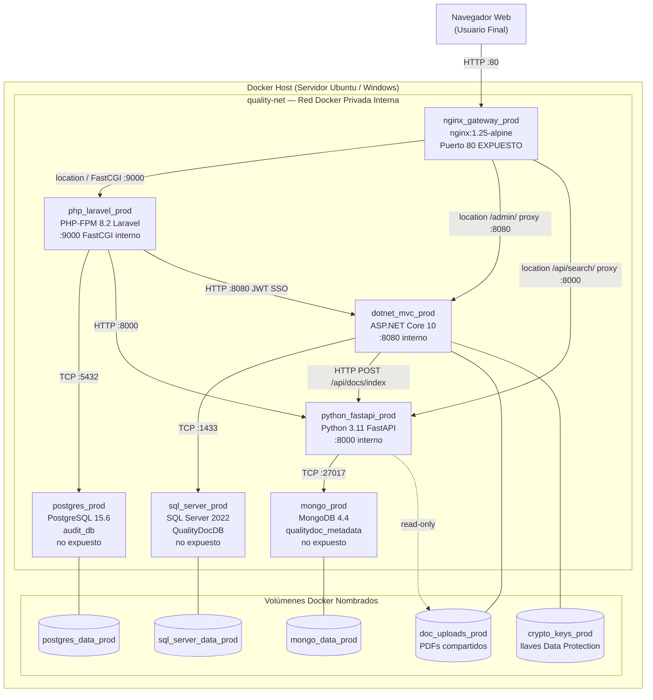
```mermaid
graph TB
    Browser["Navegador Web\n(Usuario Final)"]

    subgraph "Docker Host (Servidor Ubuntu / Windows)"
        subgraph "quality-net — Red Docker Privada Interna"
            Nginx["nginx_gateway_prod\nnginx:1.25-alpine\nPuerto 80 EXPUESTO"]

            DotNet["dotnet_mvc_prod\nASP.NET Core 10\n:8080 interno"]
            PHP["php_laravel_prod\nPHP-FPM 8.2 Laravel\n:9000 FastCGI interno"]
            FastAPI["python_fastapi_prod\nPython 3.11 FastAPI\n:8000 interno"]

            MSSQL["sql_server_prod\nSQL Server 2022\nQualityDocDB\nno expuesto"]
            PG["postgres_prod\nPostgreSQL 15.6\naudit_db\nno expuesto"]
            Mongo["mongo_prod\nMongoDB 4.4\nqualitydoc_metadata\nno expuesto"]
        end

        subgraph "Volúmenes Docker Nombrados"
            V1[("doc_uploads_prod\nPDFs compartidos")]
            V2[("sql_server_data_prod")]
            V3[("postgres_data_prod")]
            V4[("mongo_data_prod")]
            V5[("crypto_keys_prod\nllaves Data Protection")]
        end
    end

    Browser -->|"HTTP :80"| Nginx

    Nginx -->|"location / FastCGI :9000"| PHP
    Nginx -->|"location /admin/ proxy :8080"| DotNet
    Nginx -->|"location /api/search/ proxy :8000"| FastAPI

    DotNet -->|"TCP :1433"| MSSQL
    DotNet -->|"HTTP POST /api/docs/index"| FastAPI

    PHP -->|"TCP :5432"| PG
    PHP -->|"HTTP :8000"| FastAPI
    PHP -->|"HTTP :8080 JWT SSO"| DotNet

    FastAPI -->|"TCP :27017"| Mongo

    DotNet --- V1
    FastAPI -.->|"read-only"| V1
    DotNet --- V5
    MSSQL --- V2
    PG --- V3
    Mongo --- V4
```

---

## Inventario de Contenedores

| Contenedor | Imagen | Puerto | Red | `restart` |
|---|---|---|---|---|
| `nginx_gateway_prod` | `nginx:1.25-alpine` | **80 (expuesto)** | `quality-net` | `always` |
| `dotnet_mvc_prod` | Build propio (ASP.NET Core 10) | 8080 (interno) | `quality-net` | `always` |
| `php_laravel_prod` | Build propio (PHP-FPM 8.2) | 9000 FastCGI (interno) | `quality-net` | `always` |
| `python_fastapi_prod` | Build propio (Python 3.11) | 8000 (interno) | `quality-net` | `always` |
| `sql_server_prod` | `mssql/server:2022-CU12-ubuntu-22.04` | no expuesto | `quality-net` | `always` |
| `postgres_prod` | `postgres:15.6-alpine` | no expuesto | `quality-net` | `always` |
| `mongo_prod` | `mongo:4.4` | no expuesto | `quality-net` | `always` |
| `sql_server_init` | `alpine:latest` | — | `quality-net` | `no` (init job) |

---

## Rutas de Nginx (Enrutamiento del Gateway)

| Ruta | Destino | Protocolo | Descripción |
|---|---|---|---|
| `/` | `php-app:9000` | FastCGI | Portal Operario (Laravel) |
| `/admin/` | `dotnet-app:8080` | HTTP reverse proxy | Portal Administrativo (.NET) |
| `/api/search/` | `python-app:8000` | HTTP reverse proxy | Motor de Búsqueda (FastAPI) |

---

## Volúmenes Compartidos

| Volumen | Montado en | Modo | Propósito |
|---|---|---|---|
| `doc_uploads_prod` | `dotnet_mvc_prod:/app/wwwroot/uploads` | lectura/escritura | C# guarda los PDFs subidos |
| `doc_uploads_prod` | `python_fastapi_prod:/shared_uploads` | **read-only** | FastAPI sirve los PDFs para búsqueda |
| `crypto_keys_prod` | `dotnet_mvc_prod:/app/keys` | lectura/escritura | Llaves de Data Protection de ASP.NET Core |
| `sql_server_data_prod` | `sql_server_prod:/var/opt/mssql/data` | lectura/escritura | Datos persistentes de SQL Server |
| `postgres_data_prod` | `postgres_prod:/var/lib/postgresql/data` | lectura/escritura | Datos persistentes de PostgreSQL |
| `mongo_data_prod` | `mongo_prod:/data/db` | lectura/escritura | Datos persistentes de MongoDB | 

---

## Notas de Seguridad y Configuración

| Aspecto | Detalle |
|---|---|
| **Un solo puerto público** | Solo `nginx_gateway_prod` expone el puerto 80. Todas las bases de datos y servicios de aplicación son inaccesibles desde el exterior.   |
| **Red compartida** | `quality-net` se declara como `external: true` en los 4 compose files. Se crea una sola vez con el script `deploy.sh/deploy.bat` antes de levantar los servicios.  |
| **Headers de seguridad** | Nginx agrega `X-Frame-Options`, `X-XSS-Protection`, `X-Content-Type-Options` y `Referrer-Policy` a todas las respuestas.   |
| **Límite de carga** | `client_max_body_size 35M` en Nginx para permitir subida de PDFs grandes. [10](#9-9)  |
| **Configuración por `.env`** | Todos los secretos (contraseñas, JWT secret, SMTP) se inyectan mediante `env_file: ../.env`. Ninguna credencial está hardcodeada en los compose files.   |
| **SSO entre portales** | PHP Laravel llama directamente a `dotnet_mvc_prod:8080` para validar el JWT y establecer la sesión del operario.   |


---

# Para ver la documentacion detallada y resolver dudas aqui:
[](https://deepwiki.com/Gabriel89zz/QualityDoc-Polyglot)